# Anthem

* IP = 10.10.184.22

## Questions/Tasks:

### Task 1(Website Analysis):

* Nmap Scan Results:
```bash
PORT     STATE SERVICE       VERSION
80/tcp   open  http          Microsoft HTTPAPI httpd 2.0 (SSDP/UPnP)
| http-methods:
|_  Supported Methods: GET HEAD POST OPTIONS
| http-robots.txt: 4 disallowed entries
|_/bin/ /config/ /umbraco/ /umbraco_client/
|_http-title: Anthem.com - Welcome to our blog
3389/tcp open  ms-wbt-server Microsoft Terminal Services
| rdp-ntlm-info:
|   Target_Name: WIN-LU09299160F
|   NetBIOS_Domain_Name: WIN-LU09299160F
|   NetBIOS_Computer_Name: WIN-LU09299160F
|   DNS_Domain_Name: WIN-LU09299160F
|   DNS_Computer_Name: WIN-LU09299160F
|   Product_Version: 10.0.17763
|_  System_Time: 2022-06-27T17:40:10+00:00
| ssl-cert: Subject: commonName=WIN-LU09299160F
| Issuer: commonName=WIN-LU09299160F
| Public Key type: rsa
| Public Key bits: 2048
| Signature Algorithm: sha256WithRSAEncryption
| Not valid before: 2022-06-26T16:47:19
| Not valid after:  2022-12-26T16:47:19
| MD5:   0c8d 662b 5225 f321 7c60 ed4c 737a 9016
|_SHA-1: a7f5 d3bb efce 8a40 ecfa fee6 79d4 9e55 5ddc 032c
|_ssl-date: 2022-06-27T17:40:20+00:00; 0s from scanner time.
Service Info: OS: Windows; CPE: cpe:/o:microsoft:windows
```
* GoBuster Scan Results:
```bash
2022/06/27 23:11:54 Starting gobuster
=====================================================
/search (Status: 200)
/blog (Status: 200)
/sitemap (Status: 200)
/rss (Status: 200)
/archive (Status: 301)
/categories (Status: 200)
/authors (Status: 200)
/Search (Status: 200)
/tags (Status: 200)
/install (Status: 302)
/RSS (Status: 200)
/Blog (Status: 200)
/Archive (Status: 301)
/SiteMap (Status: 200)
/siteMap (Status: 200)
/INSTALL (Status: 302)
/Sitemap (Status: 200)
/1073 (Status: 200)
/Rss (Status: 200)
/Categories (Status: 200)
/1074 (Status: 301)
/1078 (Status: 200)
/Authors (Status: 200)
/1075 (Status: 200)
/1079 (Status: 200)
/umbraco (Status: 200)
```

1. Let's run nmap and check what ports are open.<br>

*No Answers Needed*

2. What port is for the web server?<br>

**Ans-80**

3. What port is for remote desktop service?<br>

**Ans-3389**

* At /robots.txt:<br>
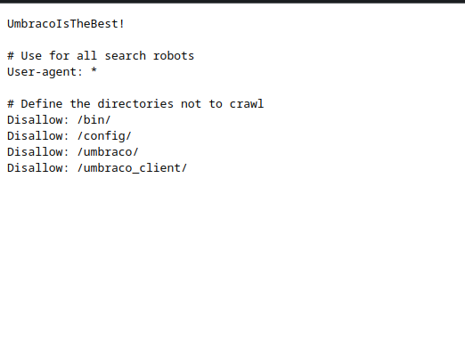

4. What is a possible password in one of the pages web crawlers check for?<br>

**Ans-UmbracoIsTheBest!**

5. What CMS is the website using?<br>

**Ans-Umbraco**

6. What is the domain of the website?<br>

**Ans-Anthem.com**

* At the /archive/we-are-hiring page we find:<br>
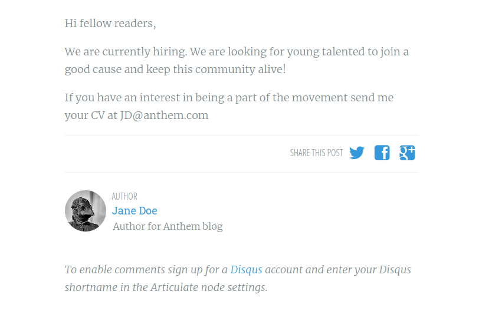
* We see that the email domain is: *anthem.com*
* At /archive/a-cheers-to-our-it-department/ we see this famous poem:
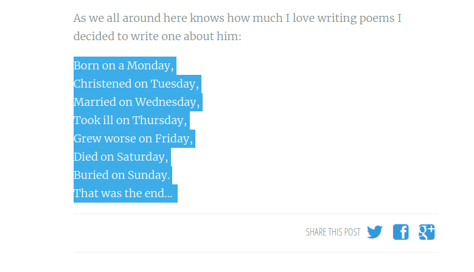
* Which probably indicates *Solomon Grundy*
* Thus, the email must be: SG@anthem.com...with reference to *JD@anthem.com* for the user *Jane Doe*

7. What's the name of the Administrator?<br>

**Ans-Solomon Grundy**

8. Can we find find the email address of the administrator?<br>

**Ans-SG@anthem.com**

### Task 2(Spot the flags):

* At the /archive/we-are-hiring/ page source:<br>
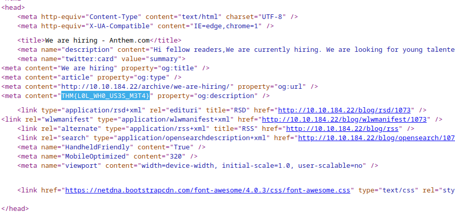

1. What is flag 1?<br>

**Ans-THM{L0L_WH0_US3S_M3T4}**

* At the index page source:<br>
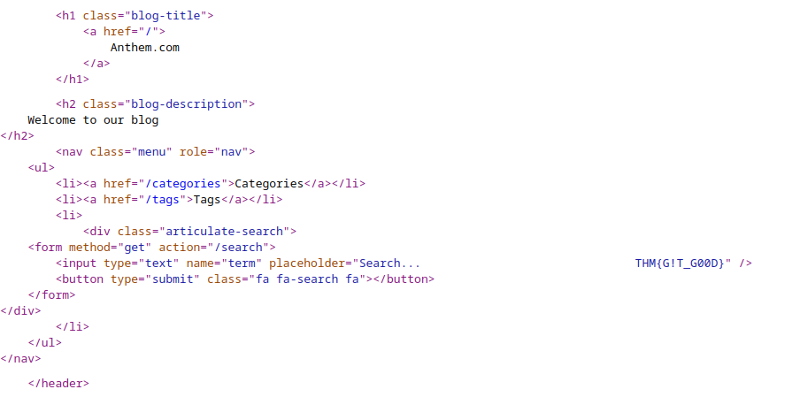

2. What is flag 2?<br>

**Ans-THM{G!T_G00D}**

* At /authors/jane-doe/:<br>
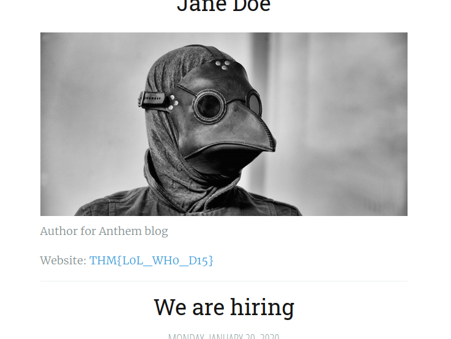

3. What is flag 3?<br>

**Ans-THM{L0L_WH0_D15}**

* At the /archive/a-cheers-to-our-it-department/ page source:<br>
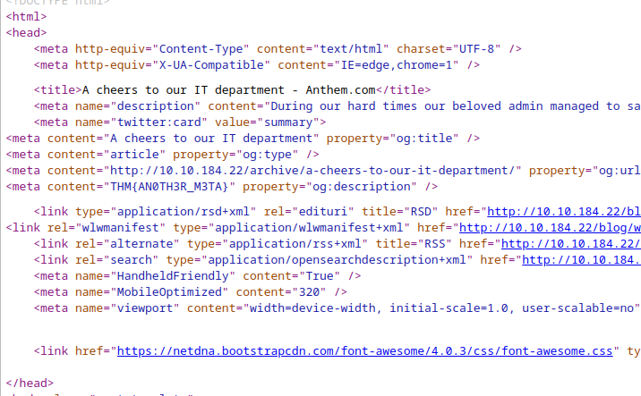

4. What is flag 4?<br>

**Ans-THM{AN0TH3R_M3TA}**

### Task 3(Final stage):

1. Let's figure out the username and password to log in to the box.(The box is not on a domain)<br>

*No Answers Needed*

* To gain access we use *xfreerdp*, since rdp client is running.
```bash
xfreerdp /u:SG /p:UmbracoIsTheBest! /v:$IP
```
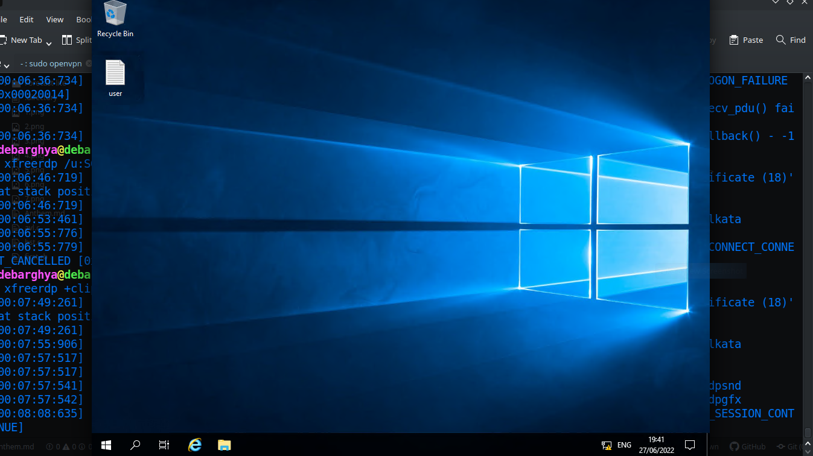

2. Gain initial access to the machine, what is the contents of user.txt?<br>

**Ans-THM{N00T_NO0T}**

* In File Manager enable view hidden directories/files then navigate to C:\
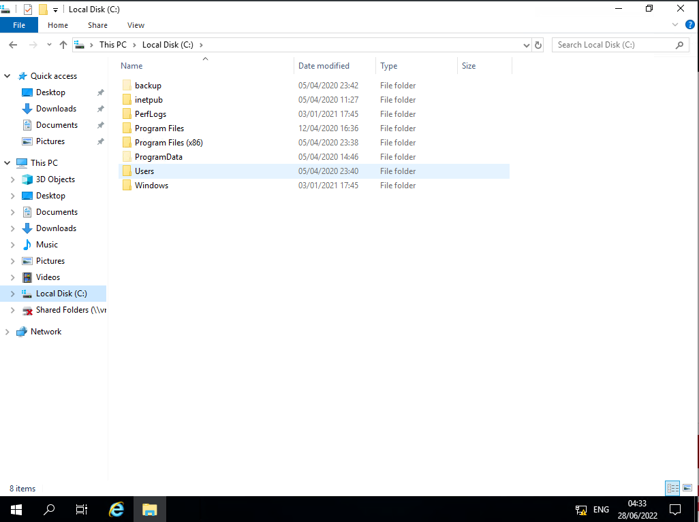
* In the Backup Folder there is a file *restore*
* Check its properties and in the security tab we can see that the permissions can be changed:
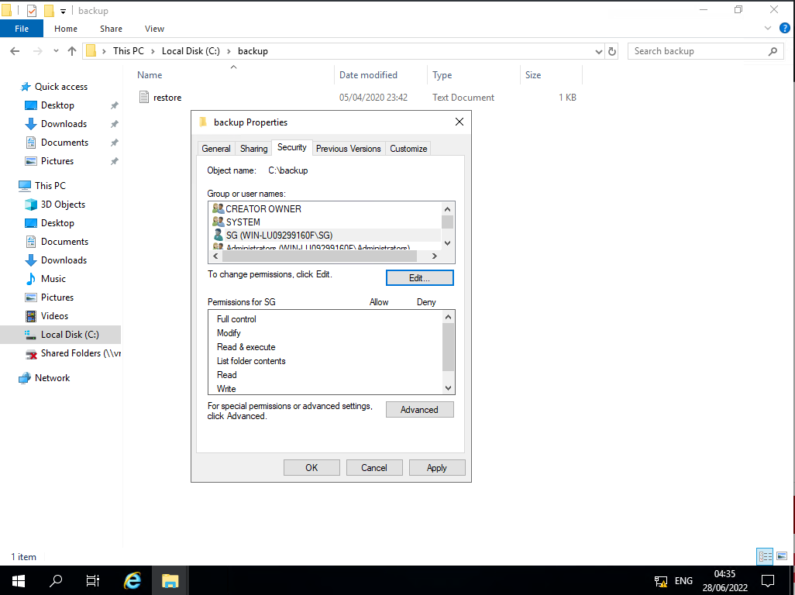
* Edit and add */Users* group in permissions box and grant them full permissions:
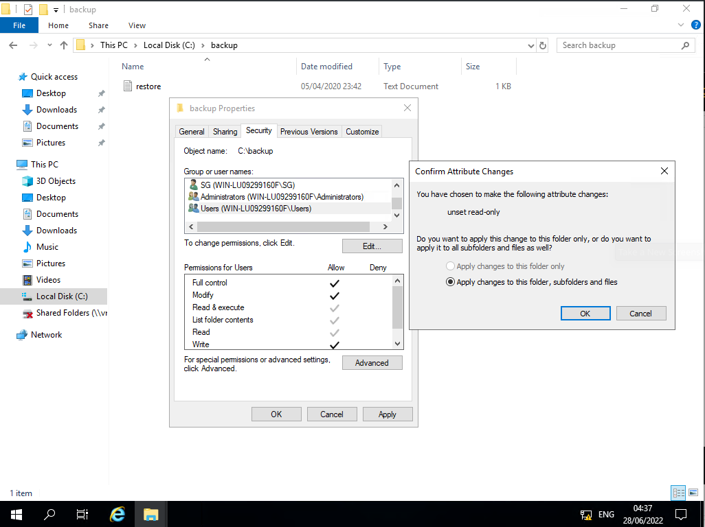
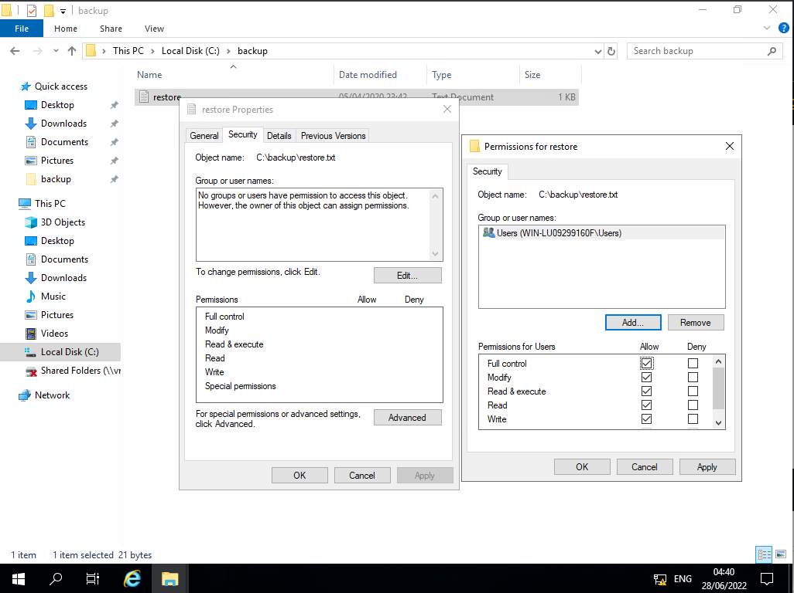
* Finally open the restore file:
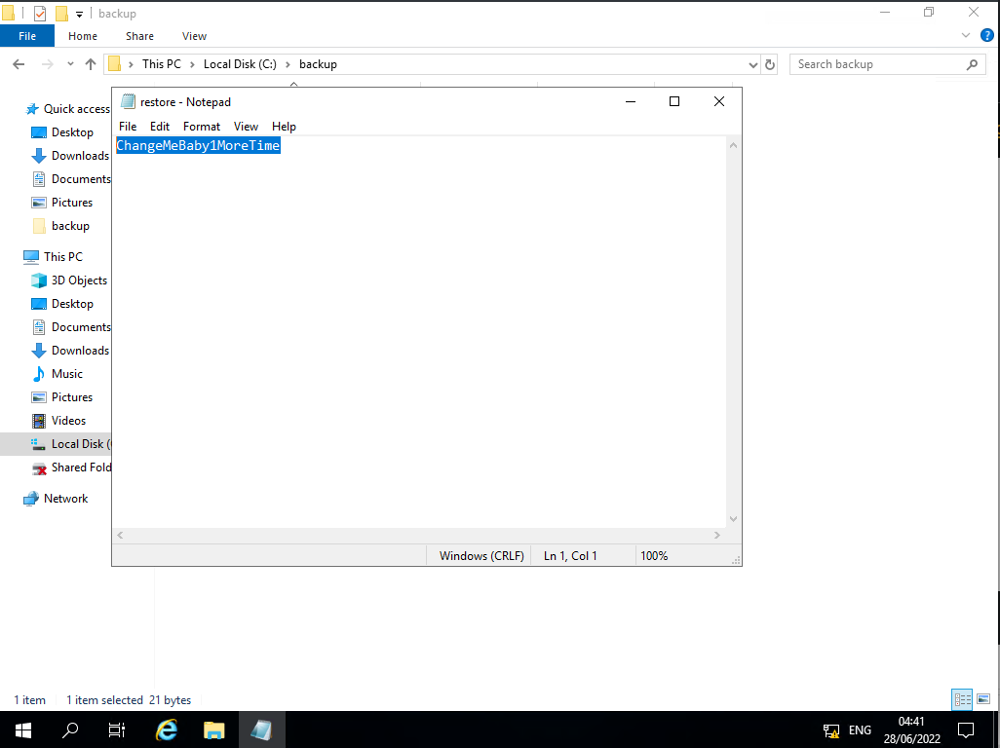

3. Can we spot the admin password?<br>

**Ans-ChangeMeBaby1MoreTime**

* Navigate to *C:\\Users\\Administrator*
* You'll be prompted for Administrator password, give the above password
* Navigate to *C:\\Users\\Administrator\\Desktop*
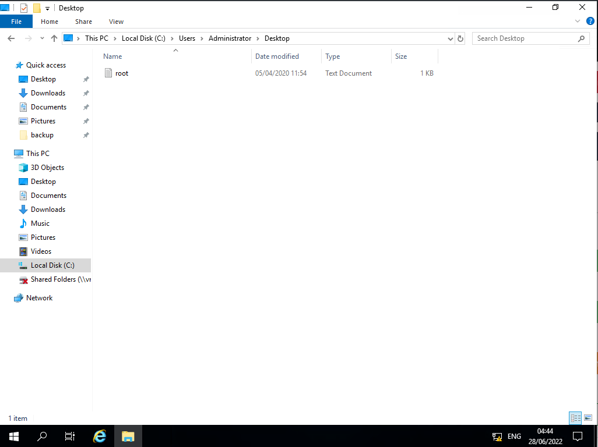

4. Escalate your privileges to root, what is the contents of root.txt?<br>

**Ans-THM{Y0U_4R3_1337}**
