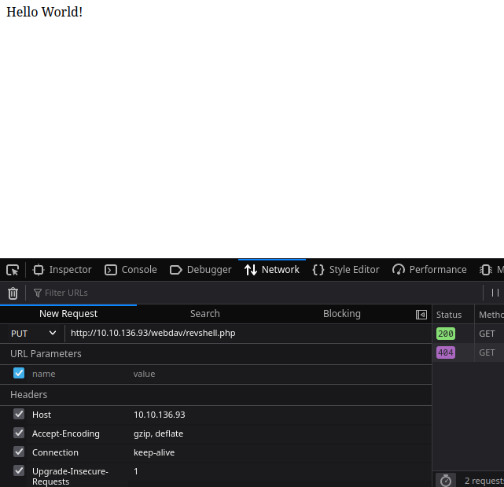
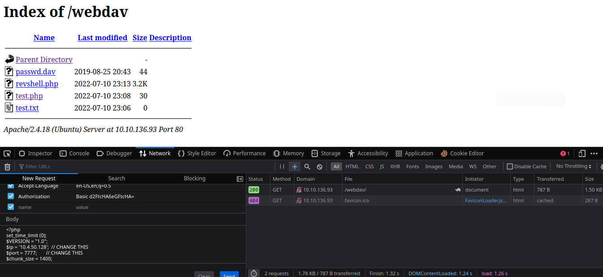

# Dav

* IP = 10.10.136.93

## Questions/Tasks:

* Initial Enumeration with *Nmap* to discover open ports on the server:`nmap -sC -sV -v $IP`.
* **Nmap Scan Results:**
```bash
PORT   STATE SERVICE REASON  VERSION
80/tcp open  http    syn-ack Apache httpd 2.4.18 ((Ubuntu))
| http-methods:
|_  Supported Methods: POST OPTIONS GET HEAD
|_http-server-header: Apache/2.4.18 (Ubuntu)
|_http-title: Apache2 Ubuntu Default Page: It works

```
* Second enumeration on the webpage with *gobuster* to find out all files and directories on the webpage:<br>
`gobuster -u "http://IP/" -w common.txt`
* **GoBuster Scan Results:**
```
/.hta (Status: 403)
/.htpasswd (Status: 403)
/.htaccess (Status: 403)
/index.html (Status: 200)
/server-status (Status: 403)
/webdav (Status: 401)
```
* The Webpage looks like this when opened in browser:<br>

* So, the webpage is just the Apache Default page, hence we have to scan with gobuster for other directories...
* Now we went to the `/webdav` directory, since we know what `401` status code means:<br>

* And as we can see we need to authenticate in order to get into the directory:<br>

* Next I did some research on **WebDav** and got a brief overview over the system:<br>

* Now since this was an easy challenge, I guessed the authentication credentials must be kept default so searched for `webdav default credentials` in google, and found these 3:
`jigsaw:jigsaw`(failed)
`adm1n:p@s$word`(failed)
`wampp:xampp`(success)

* Finally when we login, there is only one file:<br>
<br>
* And its contents were :`wampp:$apr1$Wm2VTkFL$PVNRQv7kzqXQIHe14qKA91`, i.e the username and password hash we just found <a href="http://xforeveryman.blogspot.com/2012/01/helper-webdav-xampp-173-default.html">here</a>.
* Next we searched how can we gain access to this harmless looking webpage, and found some **WebDav to RCE** <a href="https://shahjerry33.medium.com/rce-via-webdav-power-of-put-7e1c06c71e60">Writeup</a>.
* Now refering to the writeup, we first modified the request header and made an `OPTIONS` request:<br>

* And we get success in receiving the possible http-methods.
* Next we made a `PUT` request with a `test.txt` and empty body, and got success:<br>

* Now I was quite sure that we can make a `PUT` request with a reverse shell payload and get a reverse connection, but first I tried uploading a hello world script written in php:<br>

* Woooah!! success🥳🥳, next make a `PUT` request with a payload of PHP reverse-shell from <a href="https://pentestmonkey.net/cheat-sheet/shells/reverse-shell-cheat-sheet">Pentestmonkey</a> to `/webdav/revshell.php`:<br>

* After refreshing the page, we see its uploaded successfully!!
* Now visit the `revshell.php` and on the other hand start a netcat listener with:`nc -lnvp 7777`:<br>

* Just like that we get a reverse shell!!
* Do some enumeration on the machine, you'll find all home directories are readable by all users, hence no need for escalating privileges!!<br>


1. user.txt

**Ans-449b40fe93f78a938523b7e4dcd66d2a**

* A simple `sudo -l` gives this output, now getting the root flag is obviously trivial:<br>

* Overall the challenge was too much easy, but gaining the initial foothold was a bit tricky!!

2. root.txt

**Ans-101101ddc16b0cdf65ba0b8a7af7afa5**
