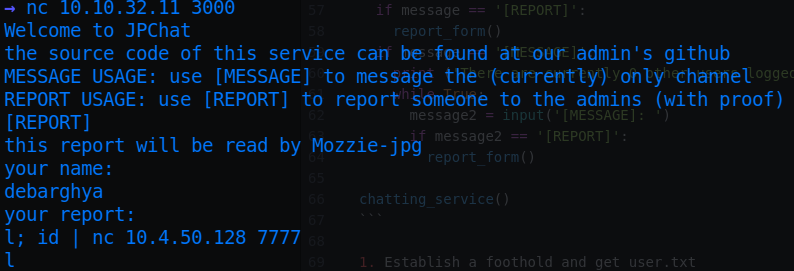
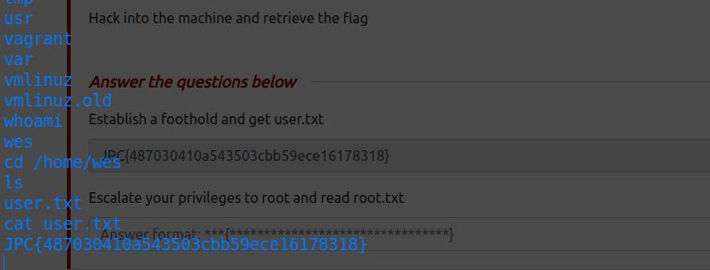

# JPGChat

* IP = 10.10.32.11

## Questions/Tasks:
* Let's start by scanning for open ports:
```bash
sudo nmap -sC -sV -sS $IP
```

### Nmap Scan results:
```bash
PORT     STATE SERVICE VERSION
22/tcp   open  ssh     OpenSSH 7.2p2 Ubuntu 4ubuntu2.10 (Ubuntu Linux; protocol 2.0)
| ssh-hostkey:
|   2048 fe:cc:3e:20:3f:a2:f8:09:6f:2c:a3:af:fa:32:9c:94 (RSA)
|   256 e8:18:0c:ad:d0:63:5f:9d:bd:b7:84:b8:ab:7e:d1:97 (ECDSA)
|_  256 82:1d:6b:ab:2d:04:d5:0b:7a:9b:ee:f4:64:b5:7f:64 (ED25519)
3000/tcp open  ppp?
| fingerprint-strings:
|   GenericLines, NULL:
|     Welcome to JPChat
|     source code of this service can be found at our admin\'s github
|     MESSAGE USAGE: use [MESSAGE] to message the (currently) only channel
|_    REPORT USAGE: use [REPORT] to report someone to the admins (with proof)
1 service unrecognized despite returning data.
```
* Trying to netcat to the service:
```bash
nc $IP 3000
```

* Nothing seems to be interesting in MESSAGE prompt
* Let's checkout the source code as it says:
* Source-code of the service:(Found in <a href="https://github.com/Mozzie-jpg/JPChat/blob/main/jpchat.py">github</a>)
```python

import os

print ('Welcome to JPChat')
print ('the source code of this service can be found at our admin\'s github')

def report_form():

	print ('this report will be read by Mozzie-jpg')
	your_name = input('your name:\n')
	report_text = input('your report:\n')
	os.system("bash -c 'echo %s > /opt/jpchat/logs/report.txt'" % your_name)
	os.system("bash -c 'echo %s >> /opt/jpchat/logs/report.txt'" % report_text)

def chatting_service():

	print ('MESSAGE USAGE: use [MESSAGE] to message the (currently) only channel')
	print ('REPORT USAGE: use [REPORT] to report someone to the admins (with proof)')
	message = input('')

	if message == '[REPORT]':
		report_form()
	if message == '[MESSAGE]':
		print ('There are currently 0 other users logged in')
		while True:
			message2 = input('[MESSAGE]: ')
			if message2 == '[REPORT]':
				report_form()

chatting_service()
```

* Hmmm 🤔 the commands given are not directly put into quotes in the report_form function...maybe we could take advantage of it!!
* If we put a `;` after 1st command and try to execute some other command we can find out in local machine as well:

* Let's try it on the server:


* See? we get valid Remote Code Execution over the chat service...
* Next we try to setup a ncat listener with /bin/bash on the server, and try to connect directly.


* Now that we have got a shell, just navigate to */home/wes* and get the flag!


1. Establish a foothold and get user.txt

**Ans-JPC{487030410a543503cbb59ece16178318}**

* As the hint says we first check the permissions for sudo group by `sudo -l`

* As we can see the *test_module.py* can be run as root requiring no passwords
* Secondly, we can see that **env_keep+=PYTHONPATH** which means while running as sudo the environment variable PYTHONPATH is kept as usual
* The $PYTHONPATH is empty if we try to echo it
* Thirdly, the compare module is not a standard module for python.
* Keeping all the above points in mind we can modify the PYTHONPATH to /tmp directory and create our own compare module...
```bash
cd /tmp
touch compare.py
chmod +x compare.py
export PYTHONPATH=$PWD
```
* To spawn a root shell we can simply edit the compare.py to:

* Now run the test_module.py as sudo:

* Finally, navigate to /root and find the flag:

2. Escalate your privileges to root and read root.txt

**Ans-JPC{665b7f2e59cf44763e5a7f070b081b0a}**
